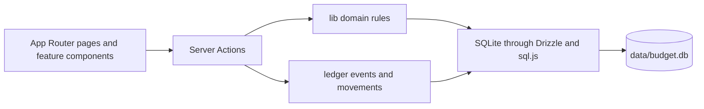

# LocalFi

LocalFi is a local-first personal finance app for accounts, liabilities,
transactions, budgets, assets, investments, travel, and net-worth history.
Your data lives in one SQLite file that stays on your machine.

> **Local-only by design.** LocalFi has no authentication. Keep it on your
> machine or a trusted network; the default Docker setup binds only to
> `127.0.0.1`.

## What it does

- Tracks assets and liabilities from one account model.
- Records transactions, transfers, recurring rules, and monthly budget moves.
- Maintains an append-only financial ledger for confirmed facts.
- Records daily net-worth and holding values, with optional live commodity and
  crypto pricing.
- Provides reports, privacy mode, and a developer ledger explorer.

## Ports and services

| Service | Port | Purpose |
| --- | --- | --- |
| LocalFi | `1313` | Next.js UI and Server Actions |
| Drizzle Studio | `4983` | Optional SQLite browser via `bun run db:studio` |

## Prerequisites

| Tool | Version | Check |
| --- | --- | --- |
| Node.js | 20+ | `node --version` |
| Bun | 1.3.14 | `bun --version` |
| Docker Compose | Current | `docker compose version` |

## Getting started

### Local development

```bash
bun install --frozen-lockfile
cp .env.example .env.local
bun run db:setup
bun run dev
```

Open <http://localhost:1313>.

### Docker

```bash
docker compose up -d --build
```

Open <http://localhost:1313>. Verify with `docker compose ps`; `app` should
be healthy. The bind-mounted `data/` directory is your live database and is
ignored by Git and Docker build context.

## Verification

```bash
bun run lint
bun run typecheck
bun run test
bun run build
```

Run `bun run test:tz` when changing calendar or ledger behavior. Run
`bun audit --prod --audit-level=high` before a release.

## Architecture



| Layer | Location | Role |
| --- | --- | --- |
| Routes | `app/(dashboard)/` | Page composition and feature entry points |
| Actions | `app/actions/` | Validation, reads, mutations, and revalidation |
| Domain | `lib/` | Money, dates, balances, budgets, reports, pricing, and recurrence |
| Ledger | `lib/ledger/` | Canonical events, movements, projections, and verification |
| Database | `lib/db/`, `lib/db/schema/`, `drizzle/migrations/` | Database lifecycle, schema, and migration history |
| UI | `components/<feature>/` | Feature controls; `components/ui/` contains shadcn primitives |

## Where to put new code

| Change | Location | Example |
| --- | --- | --- |
| Add a page | `app/(dashboard)/<feature>/` | `budgets/page.tsx` |
| Add a financial action | `app/actions/` | `transactions.ts` |
| Add deterministic business logic | `lib/` | `budgets.ts`, `cash-balance.ts` |
| Add a ledger projection or invariant | `lib/ledger/` | `verify.ts`, `rebuild.ts` |
| Add a UI workflow | `components/<feature>/` | `components/budgets/` |
| Add a schema field | `lib/db/schema/` then `bun run db:generate` | `schema/budgets.ts` |
| Add a migration check | `lib/db/upgrade.ts` and `lib/db/__tests__/` | `migration-0015.test.ts` |

## Invariants

- Money is stored and calculated as integer cents.
- Calendar days use local `YYYY-MM-DD` keys; never derive them with
  `toISOString()`.
- Confirmed financial changes append ledger events; they are not rewritten.
- Transfers are not income or expense.
- One LocalFi process writes a database file at a time.
- `data/` is personal data. Never commit, copy into an image, or overwrite it
  during development.

## Configuration

| Variable | Required | Purpose |
| --- | --- | --- |
| `DATABASE_URL` | No | SQLite URL; defaults to `file:./data/budget.db` |
| `BUDGET_DB_PATH` | No | Direct database-file override for scripts and tests |
| `NEXT_PUBLIC_APP_URL` | No | LocalFi URL; defaults to `http://localhost:1313` |
| `DOCKER_UID` / `DOCKER_GID` | No | Host user IDs for the Docker bind mount |
| `NOMINATIM_URL` | No | Geocoding endpoint for travel locations |
| `NOMINATIM_USER_AGENT` | No | User agent for that geocoding endpoint |
| `AGENT_API_TOKEN` | For `/api/snapshot` | Bearer token for the optional snapshot scheduler |

## Docs

- [docs/REFERENCE.md](docs/REFERENCE.md) — code map, routes, extension points,
  and operational boundaries. Keep this in sync when structure changes.
- [docs/DECISIONS.md](docs/DECISIONS.md) — durable architectural decisions and
  rejected alternatives.
- [CONTRIBUTING.md](CONTRIBUTING.md) — contribution workflow.
- [SECURITY.md](SECURITY.md) — reporting and deployment boundary.

The schema files and migration journal are the source of truth for persisted
data. The code reference is the source of truth for where new code belongs.
