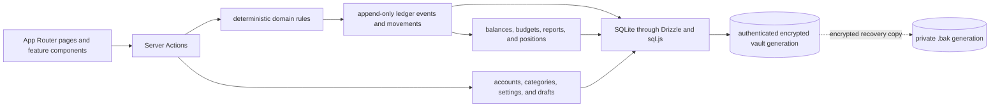

<h1 align="center">
  
</h1>

<p align="center">
  
  
  
  
  <br />
  
  
  
  
</p>

<p align="center">
  <sub>Built with shadcn/ui, Radix UI, Recharts, MapLibre GL, and Vitest.</sub>
</p>

LocalFi is a local-first app for accounts, transactions, budgets, investments,
travel, and net worth. Its canonical SQLite database and `.bak` recovery copy
are encrypted on your machine. Confirmed financial facts enter one append-only,
hash-linked ledger that drives balances, budgets, reports, and positions.

> **Local-only by design.** The default Docker setup binds to `127.0.0.1`.
> LocalFi is not a hardened multi-user or internet-facing service.

## Customize your LocalFi

**Every component is customizable:** layout, colors, categories, reports,
workflows, data model, ledger projections, and local integrations. Start your
coding agent at the repository root with a concrete outcome:

<p align="center">
  <picture>
    <source media="(prefers-color-scheme: dark)" srcset="https://raw.githubusercontent.com/lobehub/lobe-icons/4aaf4ee1fb2678a7f989ea570f0f6ce14a9abf75/packages/static-png/dark/openai.png" />
    
  </picture>&nbsp;&nbsp;
  <picture>
    <source media="(prefers-color-scheme: dark)" srcset="https://raw.githubusercontent.com/lobehub/lobe-icons/4aaf4ee1fb2678a7f989ea570f0f6ce14a9abf75/packages/static-png/dark/claude-color.png" />
    
  </picture>&nbsp;&nbsp;
  <picture>
    <source media="(prefers-color-scheme: dark)" srcset="https://raw.githubusercontent.com/lobehub/lobe-icons/4aaf4ee1fb2678a7f989ea570f0f6ce14a9abf75/packages/static-png/dark/gemini-color.png" />
    
  </picture>&nbsp;&nbsp;
  <picture>
    <source media="(prefers-color-scheme: dark)" srcset="https://raw.githubusercontent.com/lobehub/lobe-icons/4aaf4ee1fb2678a7f989ea570f0f6ce14a9abf75/packages/static-png/dark/cursor.png" />
    
  </picture>&nbsp;&nbsp;
  <picture>
    <source media="(prefers-color-scheme: dark)" srcset="https://raw.githubusercontent.com/lobehub/lobe-icons/4aaf4ee1fb2678a7f989ea570f0f6ce14a9abf75/packages/static-png/dark/windsurf.png" />
    
  </picture>&nbsp;&nbsp;
  <picture>
    <source media="(prefers-color-scheme: dark)" srcset="https://raw.githubusercontent.com/lobehub/lobe-icons/4aaf4ee1fb2678a7f989ea570f0f6ce14a9abf75/packages/static-png/dark/githubcopilot.png" />
    
  </picture>&nbsp;&nbsp;
  <picture>
    <source media="(prefers-color-scheme: dark)" srcset="https://raw.githubusercontent.com/lobehub/lobe-icons/4aaf4ee1fb2678a7f989ea570f0f6ce14a9abf75/packages/static-png/dark/opencode.png" />
    
  </picture>&nbsp;&nbsp;
  <picture>
    <source media="(prefers-color-scheme: dark)" srcset="https://raw.githubusercontent.com/lobehub/lobe-icons/4aaf4ee1fb2678a7f989ea570f0f6ce14a9abf75/packages/static-png/dark/pi.png" />
    
  </picture>
</p>

```text
Understand this LocalFi repository, then help me customize it by [describe the outcome you want]. Before editing, read AGENTS.md, every scoped rule it identifies for the files you expect to touch, and the relevant parts of README.md, docs/REFERENCE.md, and docs/DECISIONS.md. Trace the existing implementation, its callers, data flow, and nearby tests. Summarize the constraints you found and propose the smallest coherent plan; ask only about choices that would materially change the result. Preserve the local-only privacy model, integer-cents money, local calendar dates, and append-only ledger. Never inspect or derive examples from data/ or my real database; use fictional fixtures and explicit temporary database paths. Add or update regression tests, then validate every changed path with bun run validate:agent -- <changed paths> and run the full validator when the rules require it. Finish by reporting what changed, what was validated, and any remaining risks. Do not commit or push unless I explicitly ask.
```

| What you want to customize | Start here |
| --- | --- |
| Dashboard composition, components, or visual language | `app/(dashboard)/`, `components/dashboard/`, `.claude/rules/frontend.md` |
| Reports or financial calculations | `app/actions/`, `lib/`, `.claude/rules/financial-domain.md` |
| Accounts, transactions, budgets, or investments | `docs/REFERENCE.md`, `lib/db/schema/`, `lib/ledger/` |
| A local integration or provider | The nearest service in `lib/`, its Server Action boundary, and the local-only product constraints |

`AGENTS.md` and `.claude/rules/` hold the durable constraints. Work on a branch,
keep vault files outside Git, and review generated migrations before using them.
See [CONTRIBUTING.md](CONTRIBUTING.md) to propose a change upstream.

## What it does

- Tracks accounts, liabilities, transactions, transfers, budgets, and investments.
- Derives balances and reports from an append-only financial ledger.
- Records net-worth history, travel, and optional market prices.
- Includes privacy mode and a read-only ledger explorer.

## Showcase

All values come from the fictional fixture, never a personal database.

### Dashboard — Your whole financial picture

See net worth, cash flow, holdings, liabilities, and recent activity together.

<p align="center">
  
</p>

### Accounts — Balances with their history attached

Review assets, liabilities, and their shared net-worth history.

<p align="center">
  
</p>

### Transactions — Every movement, easy to trace

Filter confirmed activity while pending entries remain clearly separate.

<p align="center">
  
</p>

### Budgets — Plans measured against reality

Compare limits with ledger-derived spending and auditable reallocations.

<p align="center">
  
</p>

### Reports — Cash flow you can explain

Explain income, expenses, savings rate, and category trends from one ledger.

<p align="center">
  
</p>

### Ledger — The immutable record behind every total

Verify the hash chain and inspect each event's balanced movements.

<p align="center">
  
</p>

### Travel — A journey, not just a checklist

Map a chronological itinerary with connected stops and country flags.

<p align="center">
  
</p>

## Prerequisites

| Tool | Version | Check |
| --- | --- | --- |
| Node.js | 20+ | `node --version` |
| Bun | 1.3.14 | `bun --version` |
| Docker Compose | Current | `docker compose version` |

LocalFi serves the UI and Server Actions at `127.0.0.1:1313`.

## Getting started

### Local development

```bash
bun install --frozen-lockfile
cp .env.example .env.local
export LOCALFI_VAULT_BOOTSTRAP_TOKEN="$(node -e 'process.stdout.write(require("node:crypto").randomBytes(32).toString("base64url"))')"
printf 'One-time setup credential: %s\n' "$LOCALFI_VAULT_BOOTSTRAP_TOKEN"
bun run dev
```

Open <http://localhost:1313>, enter the printed setup credential, choose a vault
passphrase, and save the one-time recovery secret off-device. The credential
authorizes setup once; it is not your passphrase. After setup, keep the server
running and run `unset LOCALFI_VAULT_BOOTSTRAP_TOKEN`. Never save the token in a
committed file. Existing vaults start without it.

Setup is browser-only so LocalFi can show the recovery secret exactly once. It
also converts valid same-owner legacy databases and tightens permissions to
`0700` directories and `0600` files. Unsafe paths fail closed.

### Docker

```bash
export LOCALFI_VAULT_BOOTSTRAP_TOKEN="$(node -e 'process.stdout.write(require("node:crypto").randomBytes(32).toString("base64url"))')"
printf 'One-time setup credential: %s\n' "$LOCALFI_VAULT_BOOTSTRAP_TOKEN"
docker compose up -d --build
```

Open <http://localhost:1313>, complete setup, save the recovery secret, then
remove the shell copy of the token without restarting:

```bash
unset LOCALFI_VAULT_BOOTSTRAP_TOKEN
```

Verify with `docker compose ps -a`: `app` should be healthy and
`data-permissions` should exit successfully. That one-shot service assigns
`data/` to `${DOCKER_UID:-1000}:${DOCKER_GID:-1000}` and enforces private modes;
the app runs as that non-root owner. The next ordinary Compose start drops the
unset token from container configuration.

### Fictional demo

Explore a populated app without using or replacing your own database:

```bash
LOCALFI_DEMO_DIR="$(mktemp -d)"
LOCALFI_DEMO_DB="$LOCALFI_DEMO_DIR/localfi-demo.db"
bun run db:demo -- --output "$LOCALFI_DEMO_DB"
BUDGET_DB_PATH="$LOCALFI_DEMO_DB" \
  DATABASE_URL="file:$LOCALFI_DEMO_DB" \
  LOCALFI_VAULT_TEST_MODE=plaintext \
  LOCALFI_DEMO_GENERATOR=1 \
  bun run dev
```

The deterministic generator verifies its fictional ledger and refuses owner or
existing database paths.

## Verification

```bash
bun run lint
bun run typecheck
bun run test
bun run build
```

Run `bun run test:tz` for calendar or ledger changes and
`bun audit --prod --audit-level=high` before release.

### Database command boundaries

Stop LocalFi before database maintenance. Scope `LOCALFI_VAULT_PASSPHRASE` to
one command and confirm the target path; supported commands use the vault gate
and writer lease. LocalFi omits Drizzle Studio and `db:push` because they bypass
those controls. Generate schema changes with `bun run db:generate`, review the
migration, then use the managed upgrade path.

## Architecture



## Where to put new code

| Change | Location |
| --- | --- |
| Page | `app/(dashboard)/<feature>/` |
| Server Action | `app/actions/` |
| Domain rule | `lib/` |
| Ledger behavior | `lib/ledger/` |
| Feature UI | `components/<feature>/` |
| Schema or migration | `lib/db/schema/`, `drizzle/migrations/`, `lib/db/upgrade.ts` |

## Invariants

- Money is stored and calculated as integer cents.
- Calendar days use local `YYYY-MM-DD` keys; never derive them with
  `toISOString()`.
- Confirmed financial changes append ledger events; they are not rewritten.
- The ledger is the source of truth for confirmed financial facts.
- Transfers are not income or expense.
- One LocalFi process writes a database file at a time.
- Never inspect, commit, or overwrite `data/` during development.

## Configuration

| Variable | Required | Purpose |
| --- | --- | --- |
| `DATABASE_URL` | No | SQLite URL; defaults to `file:./data/budget.db` |
| `BUDGET_DB_PATH` | No | Direct database-file override for scripts and tests |
| `LOCALFI_VAULT_BOOTSTRAP_TOKEN` | First setup or conversion | One-use, random 24–512 character browser setup credential |
| `LOCALFI_VAULT_PASSPHRASE` | Headless database commands | One-process vault authorization |
| `NEXT_PUBLIC_APP_URL` | No | LocalFi URL; defaults to `http://localhost:1313` |
| `DOCKER_UID` / `DOCKER_GID` | No | Host user IDs for the Docker bind mount |
| `NOMINATIM_URL` | No | Geocoding endpoint for travel locations |
| `NOMINATIM_USER_AGENT` | No | Geocoding user agent |
| `AGENT_API_TOKEN` | For `/api/snapshot` | Bearer token for the optional snapshot scheduler |

## Security and recovery

- Vault files are encrypted and owner-only (`0700` directories, `0600` files).
- Restart, lock, or 1–120 minutes of inactivity closes the vault.
- Store the one-time recovery secret offline and apart from the database.
- CSV and JSON exports are plaintext; database exports remain encrypted.
- Use full-disk encryption: privileged or compromised processes can read an
  unlocked vault from memory.

See the [security boundary and recovery guide](docs/SECURITY.md) before exposing
LocalFi beyond its loopback-only default or running database maintenance tools.

## Docs

- [docs/REFERENCE.md](docs/REFERENCE.md) — code map and extension points.
- [docs/DECISIONS.md](docs/DECISIONS.md) — architectural decisions.
- [CONTRIBUTING.md](CONTRIBUTING.md) — contribution workflow.
- [SECURITY.md](SECURITY.md) — vulnerability-reporting policy.
- [docs/SECURITY.md](docs/SECURITY.md) — vault, recovery, and exports.

Schema and migration files define persistence; the ledger defines confirmed
financial facts; the code reference defines extension points.
