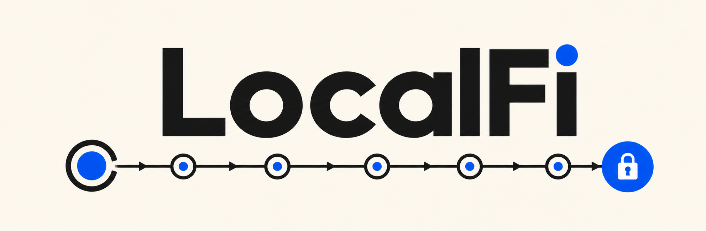
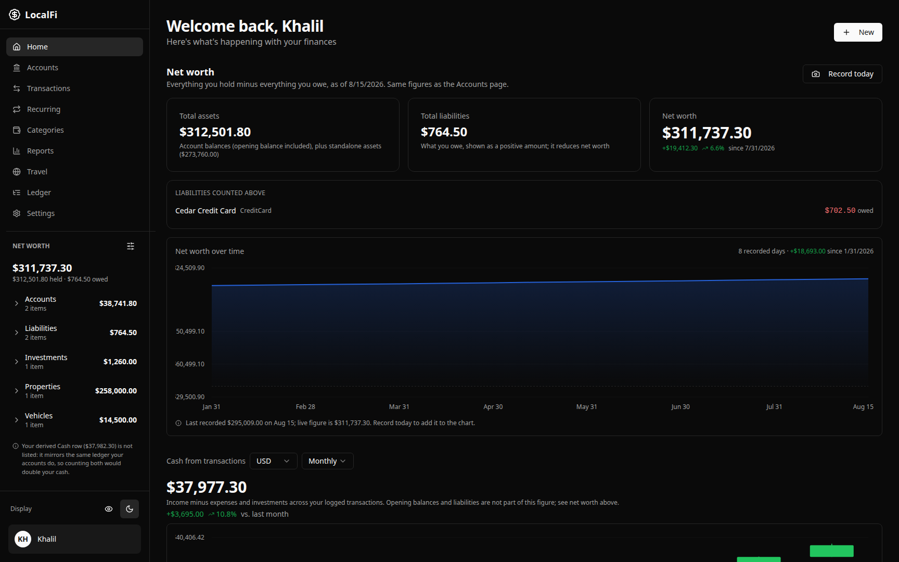
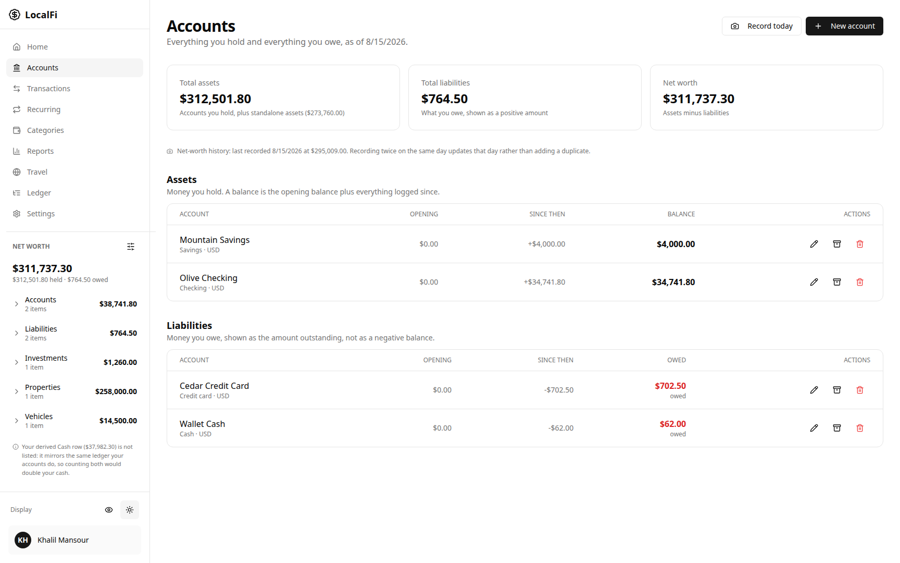
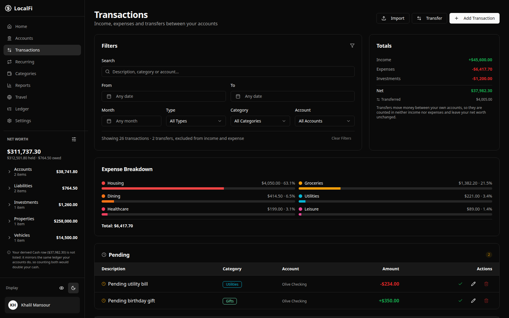
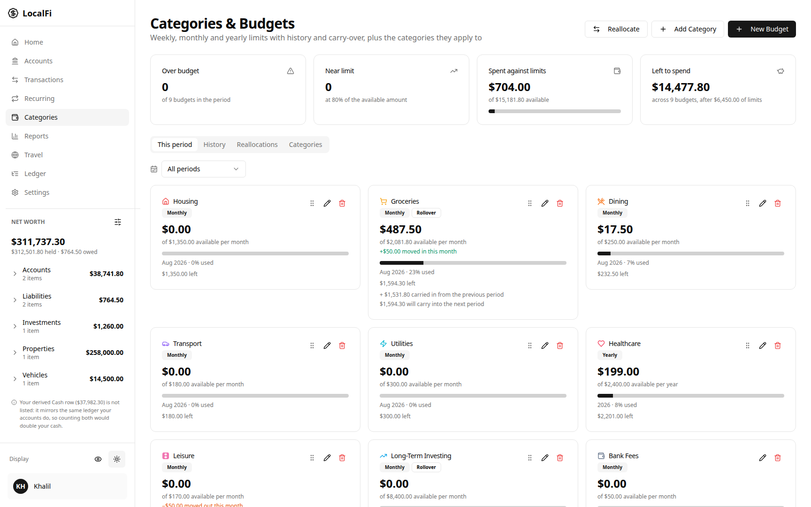
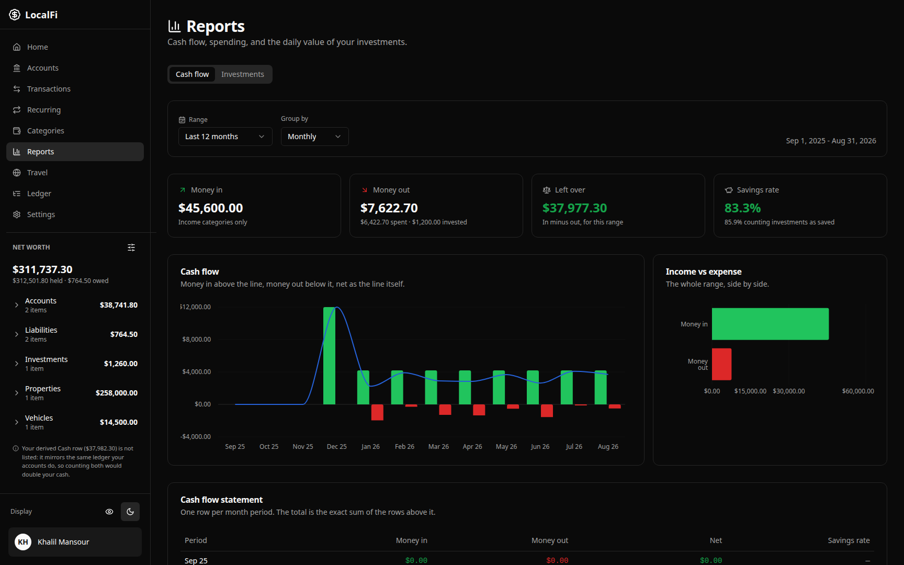
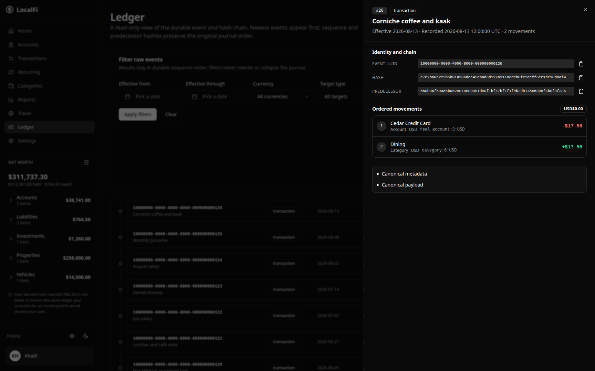
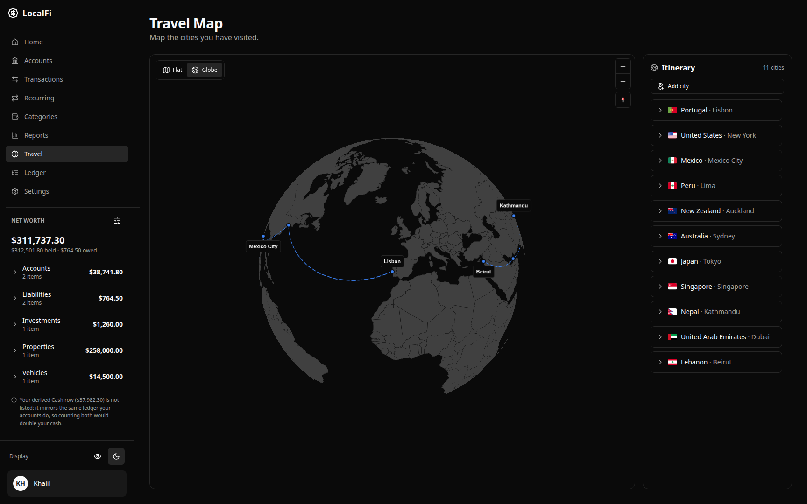
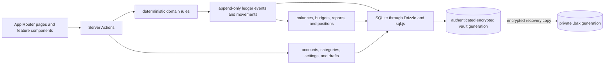

<h1 align="center">
  
</h1>

<p align="center">
  
  
  
  
  <br />
  
  
  
  
</p>

<p align="center">
  <sub>Built with shadcn/ui, Radix UI, Recharts, MapLibre GL, and Vitest.</sub>
</p>

LocalFi is a local-first app for accounts, transactions, budgets, investments,
travel, and net worth. Its canonical SQLite database and `.bak` recovery copy
are encrypted on your machine. Confirmed financial facts enter one append-only,
hash-linked ledger that drives balances, budgets, reports, and positions.

> **Local-only by design.** The default Docker setup binds to `127.0.0.1`.
> LocalFi is not a hardened multi-user or internet-facing service.

## Run LocalFi

Install [Git](https://git-scm.com/downloads) and [Docker Desktop](https://www.docker.com/products/docker-desktop/), then run:

```bash
git clone https://github.com/kevin-aoun/LocalFi.git
cd LocalFi
docker compose up --build
```

On first start, the terminal prints a **LocalFi first-run setup** link. Open it,
choose a passphrase, and save the recovery secret somewhere off this computer.
Later starts use the same Compose command and only ask for your passphrase.

Open <http://localhost:1313>. Keep the terminal open while LocalFi is running;
press `Ctrl+C` there to stop it.

## Customize your LocalFi

**Every component is customizable:** layout, colors, categories, reports,
workflows, data model, ledger projections, and local integrations.

Start a new coding-agent chat with:

```text
Understand this LocalFi repository, then help me customize it by [describe the outcome you want]. Before editing, read AGENTS.md, every scoped rule it identifies for the files you expect to touch, and the relevant parts of README.md, docs/REFERENCE.md, and docs/DECISIONS.md. Trace the existing implementation, its callers, data flow, and nearby tests. Summarize the constraints you found and propose the smallest coherent plan; ask only about choices that would materially change the result. Preserve the local-only privacy model, integer-cents money, local calendar dates, and append-only ledger. Never inspect data/, my real database, backups, or exports. Never give an agent a real or fictional database file; tests must create explicit temporary databases from minimal synthetic values. Add or update regression tests, then validate every changed path with bun run validate:agent -- <changed paths> and run the full validator when the rules require it. Finish by reporting what changed, what was validated, and any remaining risks. Do not commit or push unless I explicitly ask.
```

LocalFi ships project hooks and permissions for Cursor, Claude Code, Codex,
Gemini CLI, OpenCode, Windsurf, Cline, and Pi. Trust/enable the project controls
when your tool asks. They reject direct reads and writes to owner databases,
backups, exports, credentials, and the policy files themselves. Do not give an
agent your passphrase, recovery secret, Docker access, or an external tool that
can retrieve private files. See [Agent access](docs/SECURITY.md#agent-access).
After `bun install --frozen-lockfile`, run `bun run agent:privacy-check` to verify them.

## What it does

- Tracks accounts, liabilities, transactions, transfers, budgets, and investments.
- Derives balances and reports from an append-only financial ledger.
- Records net-worth history, travel, and optional market prices.
- Includes privacy mode and a read-only ledger explorer.

## Showcase

All displayed values are synthetic and contain no personal database content.

### Dashboard — Your whole financial picture

See net worth, cash flow, holdings, liabilities, and recent activity together.

<p align="center">
  
</p>

### Accounts — Balances with their history attached

Review assets, liabilities, and their shared net-worth history.

<p align="center">
  
</p>

### Transactions — Every movement, easy to trace

Filter confirmed activity while pending entries remain clearly separate.

<p align="center">
  
</p>

### Budgets — Plans measured against reality

Compare limits with ledger-derived spending and auditable reallocations.

<p align="center">
  
</p>

### Reports — Cash flow you can explain

Explain income, expenses, savings rate, and category trends from one ledger.

<p align="center">
  
</p>

### Ledger — The immutable record behind every total

Verify the hash chain and inspect each event's balanced movements.

<p align="center">
  
</p>

### Travel — A journey, not just a checklist

Map a chronological itinerary with connected stops and country flags.

<p align="center">
  
</p>

## Prerequisites

| Tool | Version | Check |
| --- | --- | --- |
| Git | Current | `git --version` |
| Docker Compose | Current | `docker compose version` |
| Node.js | 20+ (development only) | `node --version` |
| Bun | 1.3.14 (development only) | `bun --version` |

LocalFi serves the UI and Server Actions at `127.0.0.1:1313`.

## Development

### Local development

```bash
bun install --frozen-lockfile
cp .env.example .env.local
export LOCALFI_VAULT_BOOTSTRAP_TOKEN="$(node -e 'process.stdout.write(require("node:crypto").randomBytes(32).toString("base64url"))')"
printf 'One-time setup credential: %s\n' "$LOCALFI_VAULT_BOOTSTRAP_TOKEN"
bun run dev
```

Open <http://localhost:1313>, enter the printed setup credential, choose a vault
passphrase, and save the one-time recovery secret off-device. The credential
authorizes setup once; it is not your passphrase. After setup, keep the server
running and run `unset LOCALFI_VAULT_BOOTSTRAP_TOKEN`. Never save the token in a
committed file. Existing vaults start without it.

Setup is browser-only so LocalFi can show the recovery secret exactly once. It
also converts valid same-owner legacy databases and tightens permissions to
`0700` directories and `0600` files. Unsafe paths fail closed.

For Docker diagnostics, `docker compose ps -a` should show `app` healthy and
`data-permissions` exited successfully. That one-shot service prepares private
file permissions and creates the one-use setup link only when no encrypted
vault exists. If you missed the link, run `docker compose logs data-permissions`.

## Verification

```bash
bun run lint
bun run typecheck
bun run test
bun run build
```

Run `bun run test:tz` for calendar or ledger changes and
`bun audit --prod --audit-level=high` before release.

### Database command boundaries

Stop LocalFi before database maintenance. Scope `LOCALFI_VAULT_PASSPHRASE` to
one command and confirm the target path; supported commands use the vault gate
and writer lease. LocalFi omits Drizzle Studio and `db:push` because they bypass
those controls. Generate schema changes with `bun run db:generate`, review the
migration, then use the managed upgrade path.

## Architecture



## Where to put new code

| Change | Location |
| --- | --- |
| Page | `app/(dashboard)/<feature>/` |
| Server Action | `app/actions/` |
| Domain rule | `lib/` |
| Ledger behavior | `lib/ledger/` |
| Feature UI | `components/<feature>/` |
| Schema or migration | `lib/db/schema/`, `drizzle/migrations/`, `lib/db/upgrade.ts` |

## Invariants

- Money is stored and calculated as integer cents.
- Calendar days use local `YYYY-MM-DD` keys; never derive them with
  `toISOString()`.
- Confirmed financial changes append ledger events; they are not rewritten.
- The ledger is the source of truth for confirmed financial facts.
- Transfers are not income or expense.
- One LocalFi process writes a database file at a time.
- Never inspect, commit, or overwrite `data/` during development.

## Configuration

| Variable | Required | Purpose |
| --- | --- | --- |
| `DATABASE_URL` | No | SQLite URL; defaults to `file:./data/budget.db` |
| `BUDGET_DB_PATH` | No | Direct database-file override for scripts and tests |
| `LOCALFI_VAULT_BOOTSTRAP_TOKEN` | Local development setup | Optional explicit one-use browser setup credential |
| `LOCALFI_VAULT_BOOTSTRAP_TOKEN_FILE` | Docker setup | Owner-only credential file generated and consumed by Compose |
| `LOCALFI_VAULT_PASSPHRASE` | Headless database commands | One-process vault authorization |
| `NEXT_PUBLIC_APP_URL` | No | LocalFi URL; defaults to `http://localhost:1313` |
| `DOCKER_UID` / `DOCKER_GID` | No | Host user IDs for the Docker bind mount |
| `NOMINATIM_URL` | No | Geocoding endpoint for travel locations |
| `NOMINATIM_USER_AGENT` | No | Geocoding user agent |
| `SNAPSHOT_API_TOKEN` | For `/api/snapshot` | Bearer token for the optional snapshot scheduler |

## Security and recovery

- Vault files are encrypted and owner-only (`0700` directories, `0600` files).
- Restart, lock, or 1–120 minutes of inactivity closes the vault.
- Store the one-time recovery secret offline and apart from the database.
- CSV and JSON exports are plaintext; database exports remain encrypted.
- Use full-disk encryption: privileged or compromised processes can read an
  unlocked vault from memory.

See the [security boundary and recovery guide](docs/SECURITY.md) before exposing
LocalFi beyond its loopback-only default or running database maintenance tools.

## Docs

- [docs/REFERENCE.md](docs/REFERENCE.md) — code map and extension points.
- [docs/DECISIONS.md](docs/DECISIONS.md) — architectural decisions.
- [CONTRIBUTING.md](CONTRIBUTING.md) — contribution workflow.
- [SECURITY.md](SECURITY.md) — vulnerability-reporting policy.
- [docs/SECURITY.md](docs/SECURITY.md) — vault, recovery, and exports.

Schema and migration files define persistence; the ledger defines confirmed
financial facts; the code reference defines extension points.
