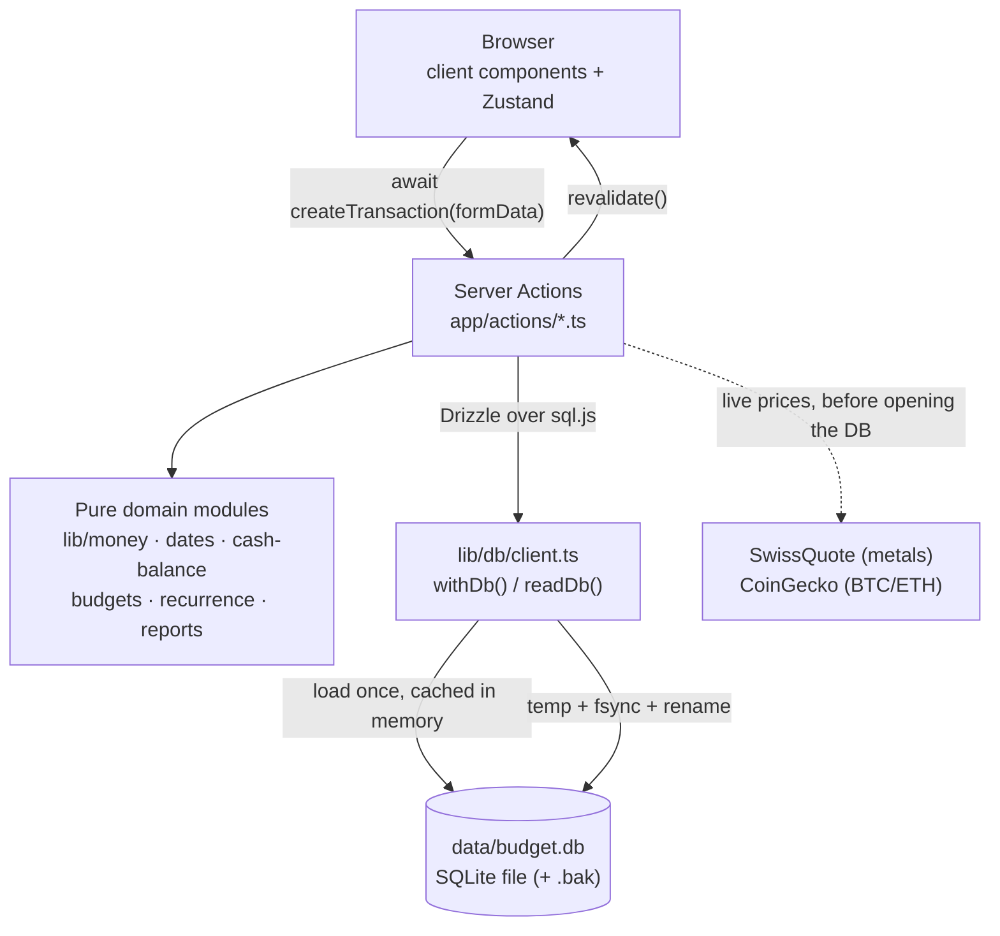

# Budget

A self-hosted personal finance app: track net worth across accounts and asset classes, log transactions and transfers against budgeted categories, run recurring templates, and report on where the money went. Single user, single file, no cloud.

Everything lives in one SQLite file (`data/budget.db`) that you own. There are no user accounts, no sync service, and no telemetry. Data reaches the browser through Next.js Server Actions.

> **Design principle** — the database is a *file*. Every mutation goes through `withDb(fn)` in `lib/db/client.ts`, which serializes writers and flushes the whole file atomically. See [Invariants](#invariants--gotchas).

> **Known limitation: there is no authentication.** Server Actions are POST endpoints, and anything that can reach the port can read and write the whole financial database. The mitigation for the container path is that it is not published beyond loopback: `docker-compose.yml` binds `127.0.0.1:1313:1313`. `next dev` listens on all interfaces, so treat it as trusted-network-only. Auth is out of scope for now — do not expose this app to the internet as it stands. See [Security posture](#security-posture).

---

## Two rules that run through the whole codebase

Break either of these and money goes quietly wrong. Both are enforced by their own module and pinned by tests.

| Rule | Owner | What it means |
| --- | --- | --- |
| **Money is integer cents.** | `lib/money.ts` | Every money column is `*_cents` and every value is a `Cents` (a safe integer). Parse with `parseAmount` / `tryParseAmount`, format with `formatMoney`, add with `sumCents`. `centsToDecimal` exists **only** for a display/chart boundary — never for arithmetic, comparison, aggregation or storage. Every exported function throws on a non-integer, so a float that leaks in fails loudly. |
| **Dates are calendar days, not instants.** | `lib/dates.ts` | A day is a `DateKey` — a `'YYYY-MM-DD'` string that sorts in calendar order. **Never call `toISOString()`** on a calendar day (it converts to UTC first and shifts the day for anyone east or west of UTC), and never `new Date(someString)` on imported input. Build Dates from local components (`new Date(y, m, d)`), serialize with `toDateKey`, parse imports with `parseFlexibleDate` / `parseExcelSerial`. |

`npm run test:tz` re-runs the whole suite at UTC+14 and UTC−11 specifically to catch a regression of the second rule.

## Ports & services

| Service | Port | Purpose | Started by |
| --- | --- | --- | --- |
| Next.js app (dev) | `1313` | App Router UI + Server Actions, Turbopack | `npm run dev` |
| Next.js app (prod) | `1313` | Standalone server (`node server.js`), bound to loopback on the host | `docker compose up` |
| Drizzle Studio | `4983` | Browse/edit the SQLite file in a GUI | `npm run db:studio` |

`npm start` runs `next start` with no `-p`, so a bare local production run listens on **3000**; the Docker image sets `PORT=1313`.

There is no separate database process — SQLite is read and written in-process via [sql.js](https://sql.js.org) (WebAssembly).

## Prerequisites

| Tool | Version | Check | Install |
| --- | --- | --- | --- |
| Node.js | 20+ (Docker image pins 20; 22 works) | `node --version` | [nodejs.org](https://nodejs.org) |
| npm | 10+ | `npm --version` | ships with Node |
| Docker + Compose | any current | `docker compose version` | [docs.docker.com](https://docs.docker.com/get-docker/) — only for the container path |

> **Run `npm install` on the machine you will run the app on.** `node_modules` contains a platform-specific `esbuild` binary (used by `tsx` for the `db:*` scripts). A `node_modules` copied from Windows to Linux/WSL fails with `You installed esbuild for another platform`; delete it and reinstall. If npm scripts fail with `Permission denied`, see [Troubleshooting](#troubleshooting).

## Getting started

### Local development

```bash
npm install
cp .env.example .env.local     # optional — defaults work as-is
npm run db:setup               # replay every migration, then seed 15 default categories
npm run dev
```

Open <http://localhost:1313>.

**Verify:** `npm run db:setup` prints `Applied 0000_…` through `Applied 0004_priced_holdings`, a `Tables: …` line, `Database saved to …/data/budget.db (N bytes)`, then `Database seeded successfully!`. `npm run dev` prints `- Local: http://localhost:1313`. The dashboard loads with an empty net-worth chart, `/accounts` shows the single seeded `Main` account at $0.00, and the sidebar reads `Cash $0.00`.

Want something to look at? `npm run db:sample` adds five example assets and six transactions.

### Docker

```bash
docker compose down
docker compose up --build -d
```

Open <http://localhost:1313>.

**Verify:** `docker compose ps` shows the `app` service as `healthy` within ~20–40s (there is a `wget` healthcheck against `/`). The server itself is ready in well under a second; the delay is the healthcheck interval.

Two things in `docker-compose.yml` look like tidy-up candidates and are not:

- The port is published as `127.0.0.1:1313:1313`, **not** `1313:1313`. The app has no authentication, so publishing on all interfaces would hand the whole database to the local network.
- The healthcheck probes `http://127.0.0.1:1313/`, **not** `localhost`. Alpine's `wget` resolves `localhost` to `[::1]`, while the standalone server binds `0.0.0.0` (IPv4 only) — a `localhost` probe is refused forever and the container never leaves `health: starting`.

The image builds its **own empty database** during `docker build` (`npm run db:setup`), but Compose bind-mounts your local `./data` directory over `/app/data` at runtime. Your local data is excluded via `.dockerignore`, so your real finances never enter an image layer. `docker compose down` followed by plain `docker compose up` reuses the old image; include `--build` whenever source files changed.

### Verifying a change

```bash
npm test                                          # 1124 tests, 44 files
npm run test:tz                                   # the same suite at UTC+14 and UTC-11
node node_modules/typescript/bin/tsc --noEmit      # types (the build checks these too)
node node_modules/next/dist/bin/next build         # production build
```

All four pass on a clean checkout. `npm run build` and `npm run lint` are the normal spellings of the last two; the `node …` forms are the workaround for the exec-bit problem in [Troubleshooting](#troubleshooting).

## Testing

Vitest, `environment: "node"`, no jsdom. Tests live in `**/__tests__/**` next to the code they cover and are picked up from `{lib,app,components}/**/__tests__/**/*.test.ts` (see `vitest.config.ts`).

| Command | Does |
| --- | --- |
| `npm test` | One full run. |
| `npm run test:watch` | Watch mode. |
| `npm run test:tz` | Two full runs, at `TZ=Pacific/Kiritimati` (UTC+14) and `TZ=Pacific/Niue` (UTC−11). Node reads `TZ` once at process start, so this **must** be a separate process — stubbing `TZ` inside a test does nothing. |

**How to add a test here.** There is no jsdom, so components cannot be rendered. The convention is to extract the logic out of the `.tsx` and unit-test it:

- pure logic goes in a sibling `*-logic.ts` (or a plain `.ts`) module — `components/transactions/import-logic.ts`, `components/budgets/budget-form-logic.ts`, `components/reports/report-view-logic.ts`, `components/dashboard/cash-series.ts`;
- the `.tsx` becomes wiring that imports it;
- the test targets the `-logic` module.

Server actions are tested against a real throwaway database: `app/actions/__tests__/support/temp-db.ts` points `BUDGET_DB_PATH` at a temp directory and replays the migration journal into it. Two tests assert *code shape* rather than behaviour, deliberately, because rendering is impossible: `components/__tests__/error-surfacing.test.ts` (every dialog must inspect an action's `{ error }`) and `app/actions/__tests__/money-boundaries.test.ts`.

## Architecture



| Layer | Location | Responsibility |
| --- | --- | --- |
| Pages | `app/(dashboard)/` | Route UI. `/accounts`, `/budgets`, `/recurring`, `/reports` are async server components that fetch and hand off to a `*-client.tsx`; `/`, `/transactions`, `/settings`, `/travel` are `"use client"`. |
| Server Actions | `app/actions/` | Every read and write. The only code that touches the database. |
| Domain logic | `lib/money.ts`, `lib/dates.ts`, `lib/cash-balance.ts`, `lib/budgets.ts`, `lib/recurrence.ts`, `lib/reports.ts`, `lib/prices.ts` | Pure, dependency-light, unit-tested. A `"use server"` file may only export async functions, which is why the rules live here and not in the actions. |
| DB access | `lib/db/client.ts` | Loads the SQLite file into sql.js, wraps it in Drizzle, exposes `withDb()` / `readDb()`. |
| Schema | `lib/db/schema/` | Drizzle table definitions — the source of truth for the data model. |
| Migrations | `drizzle/migrations/` | Generated SQL + `meta/_journal.json` ordering, plus the one-shot appliers in `lib/db/migrate-to-*.ts`. |
| Client state | `lib/stores/` | Zustand stores for dashboard and transactions view state (dialogs, filters, sorting). |
| Feature components | `components/{accounts,assets,budgets,dashboard,recurring,reports,settings,transactions,shared}/` | Dialogs, charts, import flow, sidebar, theme toggle — plus the `*-logic.ts` modules the tests target. |
| Primitives | `components/ui/` | shadcn/ui components. Regenerate rather than hand-edit. |

### Routes

| Route | Page | What it does |
| --- | --- | --- |
| `/` | `app/(dashboard)/page.tsx` | Net worth headline + history chart, asset cards, income/expense bar chart (daily/weekly/monthly). |
| `/accounts` | `accounts/page.tsx` → `accounts-client.tsx` | Accounts grouped by asset/liability with derived balances, archive toggle, "snapshot net worth", and a repair card for transactions with no account. |
| `/transactions` | `transactions/page.tsx` | Ledger with month/category filters, sorting, category breakdown, pending queue, transfers, spreadsheet import. |
| `/recurring` | `recurring/page.tsx` → `recurring-client.tsx` | Recurring templates, an "upcoming" list, and the *generate due transactions* button. |
| `/budgets` | `budgets/page.tsx` → `budgets-client.tsx` | Three tabs: **This period** (spend vs budget), **History** (past periods), **Categories** (the category manager). The sidebar labels this route **"Categories"**. |
| `/reports` | `reports/page.tsx` → `reports-client.tsx` | Cash-flow and Investments tabs. Investments plots each holding from the daily net-worth child ledger and has clickable line visibility controls. |
| `/travel` | `travel/page.tsx` | Visited-countries map (MapLibre, client-only via `next/dynamic`). |
| `/settings` | `settings/page.tsx` | Display name, theme, accent colour, quick-command editor. |

### Data model

All money columns are **integer cents**. All calendar-day columns are `'YYYY-MM-DD'` **text**; `transactions.date` is the one money-adjacent timestamp left.

| Table | Key columns | Notes |
| --- | --- | --- |
| `accounts` | `name` (unique), `kind`, `type`, `opening_balance_cents`, `currency`, `archived` | `kind` is `asset` \| `liability`; `type` is Checking/Savings/Cash/CreditCard/Loan/Mortgage/Investment/Other. One table for both halves of the balance sheet, so net worth is one query and the halves cannot drift. `opening_balance_cents` is a **magnitude in the user's direction** — a card with $500 outstanding stores `50000`; the single sign flip is `signedOpening` in `lib/cash-balance.ts`. |
| `transactions` | `date`, `category_id`, `account_id`, `transfer_account_id`, `amount_cents`, `comment`, `pending`, `recurring_id`, `recurring_occurrence` | `amount_cents` is always a positive magnitude; direction comes from the category's `type`. `category_id` is **nullable**: a transfer has no category. A **transfer** is `transfer_account_id` set, `category_id` NULL, `account_id` = source — net-neutral to net worth and excluded from income, expense and budget spend. `(recurring_id, recurring_occurrence)` is a partial UNIQUE index, which is what makes recurring generation idempotent in the database rather than in a cursor. |
| `categories` | `name` (unique), `type`, `monthly_limit_cents`, `icon`, `color` | `type` is `Income` \| `Expense` \| `Investment`. `icon` is a Lucide icon name. `monthly_limit_cents` is the **legacy** budget: still honoured as a monthly budget for any category with no `budgets` row (`budgetsFromLegacyLimits`). |
| `budgets` | `category_id`, `period`, `limit_cents`, `effective_from`, `effective_to`, `rollover` | `period` is `weekly` \| `monthly` \| `yearly`. `effective_from`/`_to` are inclusive `DateKey`s; `effective_to` NULL means still in force. Income categories are rejected because budgets are spending limits. `rollover` carries an unused surplus into the next period. |
| `recurring_transactions` | `name`, `account_id`, `transfer_account_id`, `category_id`, `amount_cents`, `frequency`, `interval`, `start_date`, `end_date`, `next_due`, `last_generated`, `archived` | `start_date` is the **anchor**: occurrences are computed from it by index, so "the 31st" clamps to Feb 28 for February only and returns to the 31st in March. `next_due` and `last_generated` are cursors, not the rule. Setting `transfer_account_id` makes each occurrence a transfer. |
| `assets` | `category`, `current_value_cents`, `currency`, `notes`, `commodity_type`, `quantity`, `unit`, `price_symbol`, `priced_at`, `use_live_price` | Standalone holdings, alongside accounts. **No `name` column** — use `notes` as the label. `quantity` is deliberately a `real` (a weight or a coin count, not money). `unit` is `oz`/`grams` for metals and `coins` for crypto. `price_symbol` — not `category`, not `commodity_type` — decides which feed prices it. `priced_at` NULL means it was never live-priced. |
| `net_worth_snapshots` | `date` (unique), `total_assets_cents`, `total_liabilities_cents`, `net_worth_cents`, `source`, `source_note` | One aggregate row per local calendar day. Recorded observations outrank reconstructed estimates. |
| `settings` | `user_name`, `accent_color`, `theme` | Single row. |
| `quick_commands` | `command`, `category_name`, `amount_cents`, `comment` | Powers the `/shortcut` autocomplete. Links to categories **by name**, not id. |
| `visited_countries` | `country_code` (unique, ISO 3166-1 alpha-3), `country_name` | |
| `asset_history` | `asset_id`, `value_cents`, `recorded_at` | Holding-level child rows written atomically with daily net-worth snapshots and reconstruction. Re-running a day replaces that day's values, so the investment chart cannot duplicate a holding. Rows before acquisition are omitted rather than stored as fake zeroes. |

Migrations, in journal order (`drizzle/migrations/meta/_journal.json`):

| Tag | What it did |
| --- | --- |
| `0000_acoustic_natasha_romanoff` | Baseline: categories, transactions, assets, asset_history, quick_commands, settings. |
| `0001_natural_the_santerians` | `visited_countries`. |
| `0002_money_to_cents` | Every `real` money column → integer `*_cents`. |
| `0003_accounts_and_budget_periods` | `accounts` (+ a seeded `Main` account), transfers, nullable `category_id`, `budgets`, `recurring_transactions`, `net_worth_snapshots`. |
| `0004_priced_holdings` | `assets.price_symbol`, `assets.priced_at`. |
| `0005_reconstructed_net_worth` | Marks net-worth rows as recorded or reconstructed and stores estimate provenance. |

## Where to put new code

| Task | Location | Follow this example |
| --- | --- | --- |
| Add a database table or column | `lib/db/schema/*.ts`, export it from `schema/index.ts`, then `npm run db:generate` | `lib/db/schema/net-worth.ts` |
| Add a read or write operation | a `"use server"` file in `app/actions/` | `app/actions/countries.ts` (small, full CRUD shape) or `app/actions/accounts.ts` (the current house style: `ActionResult<T>`, `readDb`/`withDb`, `revalidate()`) |
| Add a business rule (a balance, a period, a ratio) | a pure module in `lib/`, imported by the action | `lib/cash-balance.ts` |
| Add a page | `app/(dashboard)/<route>/page.tsx` (+ a `<route>-client.tsx` if it needs interactivity), plus a `navigation` entry in `components/shared/sidebar.tsx` | `app/(dashboard)/recurring/` |
| Add a create/edit dialog | `components/<feature>/<thing>-dialog.tsx`, with the validation in `<thing>-form-logic.ts` | `components/budgets/budget-dialog.tsx` + `budget-form-logic.ts` |
| Add testable component logic | `components/<feature>/<thing>-logic.ts` + `components/<feature>/__tests__/<thing>-logic.test.ts` | `components/reports/report-view-logic.ts` |
| Add shared view state (dialog open, filters) | `lib/stores/<feature>-store.ts` | `lib/stores/dashboard-store.ts` |
| Add a shadcn primitive | `npx shadcn@latest add <name>` → lands in `components/ui/` | any file in `components/ui/` |
| Add a browser-only dependency (maps, canvas) | import with `next/dynamic` + `ssr: false` | `TravelMap` in `app/(dashboard)/travel/page.tsx` |
| Add a live-priced instrument | a `PRICED_HOLDINGS` entry in `lib/prices.ts` + the symbol in `priceSymbols` in `lib/db/schema/assets.ts` (a test asserts the two lists match) | the `BTC` entry |

## Server Actions

There are no REST endpoints — these functions are called directly from components. The house pattern is: validate input, do any slow I/O (a price fetch) **first**, then one `withDb(...)` for the write, then `revalidate(...)`.

| File | Functions |
| --- | --- |
| `accounts.ts` | `getAccounts`, `getDefaultAccountId`, `getAccountBalances`, `getNetWorth`, `getNetWorthHistory`, `getLatestNetWorthSnapshot`, `createAccount`, `updateAccount`, `setAccountArchived`, `deleteAccount`, `snapshotNetWorth`, `deleteNetWorthSnapshot`, `assignOrphanTransactions` |
| `transactions.ts` | `getTransactions`, `getTransfers`, `syncCashAssetManually`, `createTransaction`, `updateTransaction`, `confirmTransaction`, `deleteTransaction`, `createTransfer`, `updateTransfer` |
| `budgets.ts` | `getBudgets`, `getBudgetsForCategory`, `getSpendVsBudget`, `getBudgetHistory`, `createBudget`, `updateBudget`, `deleteBudget`, `importLegacyBudgets` |
| `recurring.ts` | `getRecurringTransactions`, `getUpcomingRecurring`, `getRecurringFormOptions`, `createRecurringTransaction`, `updateRecurringTransaction`, `setRecurringArchived`, `deleteRecurringTransaction`, `generateDueTransactions` |
| `categories.ts` | `getCategories`, `createCategory`, `updateCategory`, `countCategoryUsage`, `deleteCategory` |
| `assets.ts` | `getAssets`, `getInvestmentHistory`, `createAsset`, `updateAsset`, `deleteAsset` |
| `crypto.ts` | `getLivePriceQuote`, `createLivePricedAsset`, `updateLivePricedAsset` — quote and write paths for any live-priced holding |
| `commodities.ts` | `calculateCommodityValue` — the legacy metals-facing value wrapper over `lib/prices.ts`; no database access |
| `import.ts` | `importTransactions` — a whole spreadsheet in one `withDb`: validate every row, insert nothing if any row is bad, dedupe, re-derive Cash once |
| `export.ts` | `exportTransactionsCsv`, `exportJsonBackup`, `describeDatabaseLocation`, `exportDatabaseFile` |
| `settings.ts` | `getSettings`, `updateSettings` (settings and quick commands are saved together, in one atomic `withDb`) |
| `countries.ts` | `getVisitedCountries`, `toggleCountry` |

## Getting your data out

All three live on `/reports` → **Export**.

| Export | Fidelity |
| --- | --- |
| **CSV** of transactions over a range | Header row is `Date, Category, Amount, Description, Type, Account, Pending, Transfer To, Currency`. The first five names are exactly what the app's own importer looks for, so a CSV export **round-trips back through the importer** — asserted end-to-end in `lib/__tests__/reports-csv-roundtrip.test.ts`. `Amount` is the stored magnitude; direction comes from the category. UTF-8 BOM, CRLF. |
| **JSON backup** of every table | Human-readable and lossless: money is an exact two-decimal string that `parseAmount` reads back to the same integer cents. |
| **The SQLite file** | The real backup. Read inside `readDb(...)` so no flush can be in flight, and the SQLite header is verified before the bytes are handed over, so a corrupt file is refused rather than downloaded as a "backup". |

Import (Transactions → *Import*) accepts **`.xlsx`, `.xls` and `.csv`**, all through the same reader and the same rules. Recognised column headers, case- and space-insensitive:

| Column | Aliases | Required | Notes |
| --- | --- | --- | --- |
| `Date` | `Transaction Date`, `Value Date`, `Posted` | Yes | Excel serial numbers or `YYYY-MM-DD`. |
| `Amount` | `Value`, `Sum` | Yes | Sign is used to infer a type when the file names none, then dropped — the magnitude is stored. |
| `Category` | — | Yes | Matched to an existing category by exact name. Unknown names prompt you to create them. |
| `Description` | `Comment`, `Details`, `Narrative`, `Memo` | No | |
| `Type` | — | No | Only used when creating a missing category, or to infer direction; defaults to `Expense`. |

`DD/MM` vs `MM/DD` is **never guessed silently**. `detectDateOrder` looks for unambiguous evidence in the file (a day > 12), and the dialog exposes an explicit day-first toggle for the rest. `.xlsx`/`.xls` date cells are read as raw serials, so most files never reach the ambiguous path at all.

## Configuration

Copy `.env.example` to `.env.local`. **The defaults work with no changes** — nothing here is required.

| Variable | Required | Description |
| --- | --- | --- |
| `BUDGET_DB_PATH` | No | **Where the app reads and writes the database.** Absolute, or relative to `process.cwd()`. Defaults to `<cwd>/data/budget.db`. Honoured by `lib/db/client.ts` *and* by `lib/db/init.ts`, so `db:init` and the app can never disagree about which file is "the database". This is how the test suite works in a temp directory. Not in `.env.example`. |
| `BUDGET_DB_DEBUG` | No | `1` / `true` emits the verbose `[DB] …` lifecycle logs. Errors and warnings are always logged. |
| `DATABASE_URL` | No | Read **only** by `drizzle.config.ts`, i.e. the `drizzle-kit` CLI (`db:generate`, `db:push`, `db:studio`). Defaults to `file:./data/budget.db`. Setting it does **not** move where the app reads and writes — that is `BUDGET_DB_PATH`. |
| `NODE_ENV` | No | Standard Node/Next convention. |
| `NEXT_PUBLIC_APP_URL` | No | Set in `docker-compose.yml` but **not read anywhere in the application code**. Harmless; kept for future absolute-URL needs. |

**Secrets policy: there are none.** No API keys, no auth tokens. Both price feeds are public and keyless, which is deliberate — see [Design decisions](#design-decisions). `.env*.local`, `/data` and `*.db` are gitignored; keep it that way, because `data/budget.db` is your actual financial history.

## Security posture

Stated plainly, because an open-source finance app invites the question:

- **No authentication, no authorization, no rate limiting.** Server Actions compile to POST endpoints; anything that can reach the port can do anything the UI can do. This is a decided trade-off for a single-user local app, not an oversight to be fixed by a reverse proxy afterthought.
- **The mitigation is the binding.** `docker-compose.yml` publishes `127.0.0.1:1313:1313`. Do not change that to `1313:1313`, and do not put this behind a public ingress, without adding auth first. Note that `next dev` (and `next start` without `HOSTNAME`) listens on all interfaces — the loopback guarantee is the compose file's, not the framework's.
- **Outbound traffic** is listed in [Invariants](#invariants--gotchas). Nothing is ever pushed; no telemetry.
- **Your data never enters the image.** `data` is in `.dockerignore`; the image builds its own empty database.

## Workflow example

The golden path — log a coffee, watch the balance move:

1. **Set up a shortcut.** Settings → Quick Commands → add `command: coffee`, `category: Dining`, `amount: 4.50`, `comment: Coffee`. Save.
2. **Log it.** Transactions → *Add Transaction* → type `/coffee` in the description field. The dialog autocompletes category, amount, and comment. Submit.
3. **What happened server-side.** `createTransaction()` parsed `"4.50"` to `450` cents via `parseAmount`, resolved the account (the form's, else the oldest non-archived asset account), inserted the row, and ran `syncCashAssetWithin()` — which recomputes the whole ledger through `deriveCashBalanceCents` and writes the total to the `Cash` asset. Then one flush to disk, then `revalidate("/transactions", "/")`. (This particular action is still on the deprecated `getDb()`/`saveDb()` shape — see [Invariants](#invariants--gotchas).)
4. **See it.** The sidebar's Cash figure drops by $4.50, the dashboard's net worth follows, `/budgets` shows Dining $4.50 closer to its $70 monthly limit, and `/reports` counts it as expense in the current period.

Not sure whether a transaction really cleared? Mark it **pending**. It sits in a separate queue on `/transactions` and is excluded from every balance, budget and report figure until you confirm it with a date — reports count and subtotal what they excluded rather than dropping it silently.

Moving money between your own accounts? Use a **transfer**, not two transactions. `createTransfer` stores one row with `transfer_account_id` set and no category, which is net-neutral to net worth and invisible to income, expense and budget totals.

## Invariants & gotchas

Things that break if you change them carelessly.

**Database**

- **`withDb` is NOT reentrant.** Calling `withDb` inside `withDb` **deadlocks** — the FIFO lock is not recursive. Helpers that need an open handle take one as a parameter instead (`syncCashAssetWithin(db)` in `lib/db/sync-cash.ts`). Likewise, **do slow I/O before you open the lock**: a price fetch inside `withDb` holds every other writer for the duration of a network round trip. `app/actions/crypto.ts` fetches, *then* writes.
- **`getDb()` / `saveDb()` are deprecated but not gone.** They now share one cached in-memory database instead of loading a private copy per call, so the old lost-update race is gone — but they still cannot roll back or group a read-modify-write, so a mutation that throws half-way can be flushed by a *later* `saveDb()` from another action. New code uses `withDb` (mutations) or `readDb` (queries). **Still on the old shape, and the obvious next migration:** all of `app/actions/transactions.ts` except `createTransfer`/`updateTransfer`, all of `app/actions/countries.ts`, and the `db:seed` / `db:sample` scripts.
- **A failed `withDb` callback discards the in-memory image.** That is the point: partial work cannot be flushed by a later save. The next call reloads from disk.
- **`PRAGMA foreign_keys = ON` is re-applied after every flush.** `sql.js`'s `Database.export()` internally closes and re-opens the connection, which silently resets connection-scoped pragmas. `applySessionPragmas` runs after every load *and* after every export. Remove that second call and foreign keys quietly stop being enforced.
- **A corrupt or unreadable file throws `DatabaseCorruptError`; it never boots an empty database.** Silently starting fresh over somebody's finances is the worst possible failure mode. The previous generation is kept at `data/budget.db.bak` on every flush.
- **`db:init` refuses to overwrite a non-empty database.** That guard is the only thing between a stray `npm run db:setup` and your entire financial history. Pass `--force` only when you mean it.
- **`lib/db/client.ts` carries a legacy auto-migration net** that adds `transactions.pending` and creates `visited_countries` if missing, for databases created before those migrations existed. New schema changes belong in a real migration; that block is repair, not the mechanism.
- **Don't edit through `npm run db:studio` while `npm run dev` is writing.** The client notices an out-of-process change and reloads, but two writers rewriting a whole file is still last-one-wins on the entire database.

**Build & runtime**

- **`next.config.ts` sets `serverExternalPackages: ["sql.js"]`. This is load-bearing — do not "clean it up".** sql.js ships an emscripten/UMD wrapper; when webpack bundles it for the server build, that wrapper's `module.exports` assignment is rewritten and loading it throws `TypeError: Cannot set properties of undefined (setting 'exports')`. The failure is **invisible under `next dev`** (Turbopack) and appears only under `next start` and in the Docker image, where every server-rendered DB-backed route — `/accounts`, `/budgets`, `/recurring`, `/reports` — returns HTTP 500. Marking it external makes the server `require()` it from `node_modules` at runtime, which is also why the Dockerfile copies `node_modules/sql.js` into the runner stage.
- **`eslint.ignoreDuringBuilds: true`.** The build prints `Skipping linting` — run lint yourself. `typescript.ignoreBuildErrors` is `false`, so type errors *do* fail the build.
- **Outbound network, exhaustively:** the two price feeds (`forex-data-feed.swissquote.com`, `api.coingecko.com`) and, on `/travel` only, a CartoDB basemap style (`basemaps.cartocdn.com`) plus a countries GeoJSON (`r2.datahub.io`). **The travel map will not render offline**; everything else works with no network at all.

**Domain**

- **The `Cash` asset is derived, never authored.** `syncCashAssetWithin()` overwrites its `current_value_cents` from the whole ledger on every transaction change. Editing it in the UI is pointless, and a *second* asset with `category: "Cash"` will be ignored — the sync targets the first one it finds.
- **Pending transactions are excluded from every balance, budget and report figure.** They still appear in the ledger and in the pending queue.
- **Transfers are never income or expense, anywhere** — not in balances, not in budget spend, not in reports. A category on a transfer row is ignored outright.
- **`opening_balance_cents` is a magnitude, not a signed figure.** The one sign flip for liabilities is `signedOpening` in `lib/cash-balance.ts`. Add a second one and a mortgage starts inflating net worth.
- **Recurring occurrences are computed from the anchor, not from the last one posted.** Advance-from-last would walk "rent on the 31st" down to the 28th forever. Idempotency rests on the partial UNIQUE index on `(recurring_id, recurring_occurrence)` first and the cursors last.
- **`quantity` is not money.** It stays a float: a troy-ounce weight or a coin count. Only `quantity × price` becomes money, rounded to the cent exactly once, in `lib/prices.ts`. And **a quantity of 0 is a real quantity** — `if (!quantity)` is a bug that has already been fixed once.
- **A failed price fetch writes nothing.** `fetchPriceQuote` never throws and never returns 0; it returns a typed error, and the previously stored value and `priced_at` survive. A live-priced holding persisted at $0 because the network was down once made real gold vanish from net worth.
- **`quick_commands.category_name` is a name, not a foreign key.** Rename a category and its quick commands stop resolving; the manager warns about missing categories on save.
- **`assets` has no `name` column.** Labels live in `notes`. This has bitten scripts before.
- **`revalidate()` (`lib/revalidate.ts`), not `revalidatePath()`, after a write.** `revalidatePath` throws outside a request scope (scripts, tests), and by then the write has already committed — letting it propagate reports "failed" for a save that succeeded, and the user retries and double-posts.
- **Accent colour is injected as inline CSS variables** (`--primary`, `--chart-1`, `--primary-foreground`) by `AccentColorProvider` in `app/providers.tsx`, deliberately leaving `--accent` alone so sidebar contrast survives. Tailwind classes alone won't explain the colours you see.

## Design decisions

| Decision | Why | Rejected alternative |
| --- | --- | --- |
| sql.js (WebAssembly SQLite) | No native compilation, no `node-gyp`, identical behaviour on Windows/macOS/Linux and inside Alpine. | `better-sqlite3` — faster and supports real transactions, but needs a native build per platform. |
| One cached in-memory image, flushed atomically per mutation | Trivially correct for one user; the database stays a single portable file you can copy, back up, or email to yourself. `withDb` gives all-or-nothing semantics without a real transaction. | A long-lived connection with WAL — better concurrency the app doesn't need. |
| Money as integer cents, everywhere | Float money drifts at the cent (`2.675 * 100 === 267.49999999999994`). Parsing is done on *strings*, so the drift is structurally impossible rather than merely unlikely. | `real` columns and rounding at the edges — which is what 0002 migrated away from. |
| Calendar days as `'YYYY-MM-DD'` strings | Sorts in calendar order, compares without a timezone, and cannot be shifted by `toISOString()`. A budget month and a report month are then the same month by construction. | Timestamps everywhere — which had already put a Beirut user's 28th into the 27th. |
| One `accounts` table for assets *and* liabilities | Net worth is `sum(assets) − sum(liabilities)`: one query over one table, so the halves cannot drift. | A parallel `liabilities` table — two inventories of money to reconcile by hand. |
| Transfers as first-class transactions | A transfer is not income or expense. Modelling it as a category ("Transfer") makes every total wrong in a way nobody notices. | Two mirrored transactions, or a magic category. |
| Server Actions instead of a REST/tRPC API | No client/server type drift, no fetch layer, no second surface to keep in sync. Note this does *not* mean "nothing to authenticate" — they are POST endpoints. | Route handlers under `app/api/` — needed only if a second client appears. |
| No authentication (for now) | Single user, loopback binding, one file on their own disk. Adding a real auth story is a project, not a checkbox, and a half-done one is worse than a documented absence. | Basic auth or a shared secret — security theatre that would invite exposing the port. |
| Balance derived from the ledger, in one module | One source of truth, so the dashboard, `/accounts`, `/budgets` and `/reports` cannot disagree. `reports.test.ts` asserts `flowInRange(...).netCents === deriveCashBalanceCents(...)` over the same rows. | Re-deriving totals per page — which is exactly how the dashboard chart once contradicted its own headline. |
| `amount_cents` always positive, sign from `category.type` | Category type already encodes direction; storing signed amounts lets the two contradict each other. | Signed amounts. |
| Keyless price providers (SwissQuote, CoinGecko) | No API key, no signup, no secret to leak in an open-source repo, and the app stays runnable by anyone who clones it. | A keyed provider (metals-api and similar). |
| Pricing keyed by *symbol*, not by commodity type | BTC and ETH are not commodities and are not on a forex feed. Widening "commodity" until it meant "anything with a price" was the alternative. | `commodityTypes += "Bitcoin"` — a lie in the schema and a broken request to SwissQuote. |
| Zustand only for view state | Server Actions own server data; stores hold dialog/filter/sort state so pages don't drown in `useState`. | Caching server data client-side, which would fight `revalidatePath()`. |
| Drizzle migrations, replayed by a custom script | `drizzle-kit migrate` doesn't target sql.js, so `lib/db/init.ts` walks the journal itself. | `db:push` for schema sync — convenient, but leaves no migration history. |
| Component logic extracted to `*-logic.ts` | There is no jsdom, so components cannot be rendered in a test. Extracting the logic makes the interesting part testable and keeps the `.tsx` as wiring. | Adding jsdom + Testing Library — a large dependency and a slower suite for behaviour that is mostly arithmetic. |

## Code map

```
app/
  layout.tsx              root layout, Inter font, Providers
  providers.tsx           next-themes + accent-colour CSS var injection
  actions/                all database access ("use server") + __tests__/
  (dashboard)/
    layout.tsx            sidebar + scrollable main
    page.tsx              dashboard (client)
    accounts/             page.tsx (server) + accounts-client.tsx
    transactions/         ledger, filters, pending queue, transfers, import (client)
    recurring/            page.tsx (server) + recurring-client.tsx
    budgets/              page.tsx (server) + budgets-client.tsx
    reports/              page.tsx (server) + reports-client.tsx
    travel/               page.tsx + travel-map.tsx (MapLibre, client-only)
    settings/             profile, theme, accent, quick commands (client)
components/
  ui/                     shadcn primitives — regenerate, don't hand-edit
  accounts|assets|budgets|dashboard|recurring|reports|settings|transactions/
                          feature dialogs + *-logic.ts modules + __tests__/
  shared/                 sidebar, theme-toggle
lib/
  money.ts                Cents, parseAmount, formatMoney, sumCents
  dates.ts                DateKey, toDateKey, parseFlexibleDate
  cash-balance.ts         THE balance rule (cash, per-account, net worth)
  budgets.ts              periods, spend-vs-budget, history
  recurrence.ts           anchored occurrence math
  reports.ts              cash flow, savings rate, comparisons, CSV serializers
  prices.ts               provider registry (SwissQuote metals, CoinGecko crypto)
  revalidate.ts           revalidatePath that can't fail a successful write
  db/
    client.ts             withDb() / readDb() — the only DB entry point
    schema/               Drizzle tables (source of truth for the model)
    sync-cash.ts          re-derive the Cash asset inside an open handle
    init.ts               replay the migration journal onto a fresh file
    seed.ts               15 default categories
    sample-data.ts        example assets + transactions
    migrate-to-cents.ts           one-shot applier for 0002
    migrate-to-accounts.ts        one-shot applier for 0003
    migrate-to-priced-holdings.ts one-shot applier for 0004
    migrate-from-json.ts  legacy one-off, see below
    verify-migration.ts   legacy one-off, see below
  stores/                 Zustand view state
  countries.ts            ISO country list for the travel map
  utils.ts                cn() helper
drizzle/migrations/       generated SQL + meta/_journal.json
data/                     budget.db + budget.db.bak (gitignored),
                          backups/ (timestamped pre-migration copies),
                          *.json.backup (pre-SQLite era)
```

### The one-shot migration appliers

`migrate-to-cents.ts`, `migrate-to-accounts.ts` and `migrate-to-priced-holdings.ts` exist to apply 0002/0003/0004 to a database that already holds real data. They are **not** the DDL — that is the `.sql` file — their job is to refuse to leave a damaged file behind. Each one has no npm script (run it explicitly) and each: writes a timestamped byte-for-byte backup to `data/backups/` first, works on an in-memory copy, verifies row counts per table, verifies the derived cash balance is **identical** before and after using the app's own `deriveCashBalanceCents`, runs `PRAGMA foreign_key_check`, re-opens and re-verifies what landed on disk, restores the backup and throws if anything fails, and refuses to run twice.

```bash
node node_modules/tsx/dist/cli.mjs lib/db/migrate-to-accounts.ts --dry-run
node node_modules/tsx/dist/cli.mjs lib/db/migrate-to-accounts.ts [--db <path>]
```

<!-- TODO: the invocation above is the exec-bit workaround for this checkout; the documented form in each script's header is `npx tsx lib/db/migrate-to-accounts.ts`. Neither was run against the live database while writing these docs. -->

`migrate-from-json.ts` and `verify-migration.ts` are older still — they moved data from the app's original JSON files into SQLite. They expect `data/categories.json` and friends, which now exist only as `*.json.backup`, so they will not run as-is. Keep them as a record or delete them.

### Scripts

| Script | Does |
| --- | --- |
| `npm run dev` | Dev server on `:1313` with Turbopack. |
| `npm run build` / `npm start` | Production build (standalone output) / serve it (port 3000 unless `PORT` is set). |
| `npm run lint` | ESLint (`next/core-web-vitals`). Not run during `build` — see [Invariants](#invariants--gotchas). Currently clean apart from three `react-hooks/exhaustive-deps` warnings. |
| `npm test` / `npm run test:watch` | Vitest, one run / watch mode. |
| `npm run test:tz` | The suite twice, at UTC+14 and UTC−11. |
| `npm run db:setup` | `db:init` then `db:seed`. The one command a fresh checkout needs. |
| `npm run db:init` | Replay every migration in journal order onto a fresh file at `BUDGET_DB_PATH`. Refuses to clobber an existing non-empty database unless passed `--force`. |
| `npm run db:seed` | Insert the 15 default categories (`onConflictDoNothing`, so re-running is safe). |
| `npm run db:sample` | Add five example assets and six transactions. |
| `npm run db:generate` | Generate a migration from schema changes. |
| `npm run db:studio` | Drizzle Studio on `:4983`. |
| `npm run db:push` | Push schema straight to the file, skipping migrations. Avoid — it leaves no history. |

### Adding a feature end to end

Adding "tags on transactions" would touch, in order:

1. `lib/db/schema/transactions.ts` — add the column; the export flows through `schema/index.ts`.
2. `npm run db:generate` — writes `drizzle/migrations/0005_*.sql` and updates the journal. If existing databases hold real data, add a one-shot applier alongside it in the shape of `lib/db/migrate-to-accounts.ts`.
3. `app/actions/transactions.ts` — read/write the field inside the existing `withDb`, then `revalidate(...)`.
4. `components/transactions/transaction-form-logic.ts` — parsing/validation, with a test in `components/transactions/__tests__/`.
5. `components/transactions/transaction-dialog.tsx` — the input, surfacing any `{ error }` the action returns.
6. `app/(dashboard)/transactions/page.tsx` + `lib/stores/transactions-store.ts` — display and filtering.
7. `npm test && npm run test:tz` — the second one if a date is involved anywhere.

## Troubleshooting

**`sh: 1: next: Permission denied` from `npm run dev` / `build` / `lint`, or `tsx: Permission denied` from any `db:*` script.**

This is **environmental, not a project requirement**: the shims in `node_modules/.bin/` lost their exec bit because `npm install` ran on a filesystem that drops it. The fix is to reinstall on a filesystem that preserves permissions (or `chmod +x node_modules/.bin/*`). To work around it without reinstalling, call the package entry point directly:

```bash
node node_modules/next/dist/bin/next build
node node_modules/next/dist/bin/next lint
node node_modules/typescript/bin/tsc --noEmit
node node_modules/tsx/dist/cli.mjs lib/db/init.ts
```

`npm test` and `npm run test:tz` are unaffected — `.bin/vitest` is a symlink, and `test:tz` invokes `node_modules/vitest/vitest.mjs` directly.

**`⚠ Mismatching @next/swc version, detected: 15.5.7 while Next.js is on 15.5.11`** during build. A stale platform binary in `node_modules`; harmless but worth fixing with a clean reinstall.

**`Refusing to open …: it is not a valid SQLite database`.** Deliberate — the app will not replace a non-empty file it cannot read. Inspect the file, or restore `data/budget.db.bak` (the previous generation) or a timestamped copy from `data/backups/`.

**`Refusing to overwrite existing database (N bytes)`** from `db:init`. Also deliberate. Use `--force` only if you truly want to discard that data.

## Tech stack

Next.js 15 (App Router) · React 19 · TypeScript 5 · Tailwind CSS 3 · shadcn/ui + Radix · Drizzle ORM · SQLite via sql.js · Zustand · Recharts · MapLibre GL · SheetJS (`xlsx`) · Vitest · Lucide

<!-- TODO: `package.json` also lists zod, react-hook-form, @hookform/resolvers, d3-geo and topojson-client (plus their @types), none of which are imported anywhere under app/, lib/ or components/ — react-hook-form only via the unreferenced `components/ui/form.tsx`. Prune before publishing, or note why they are kept. -->


## Docs map

- **This README** is the hub: setup, architecture, conventions, invariants.
- **The data model's real source of truth is `lib/db/schema/`**, not the table above — if they disagree, the schema wins and this README is stale. The same goes for the *rules*: `lib/money.ts`, `lib/dates.ts` and `lib/cash-balance.ts` carry long header comments that are the authority on money, dates and balances respectively.
- **Route, Server Action and column tables are maintained by hand.** Refresh them from `app/(dashboard)/*/page.tsx`, `app/actions/*.ts` and `lib/db/schema/*.ts`.
- No `REFERENCE.md` or `DECISIONS.md` yet. At ~29k lines of source and ~15k of tests, the **Code map** and **Design decisions** sections are the two that have outgrown a hub document — split them into `REFERENCE.md` and `DECISIONS.md` next time either one needs a substantial edit, and leave a link here.

## License

MIT.

<!-- TODO: add a LICENSE file and a repository URL before publishing. `package.json` still has `"private": true` — flip it when the repo goes public. -->
