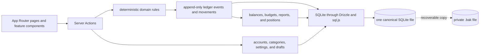

<h1 align="center">
  
</h1>

<p align="center">
  
  
  
  
  <br />
  
  
  
  
</p>

<p align="center">
  <sub>Built with shadcn/ui, Radix UI, Recharts, MapLibre GL, and Vitest.</sub>
</p>

LocalFi is a local-first personal finance app for accounts, liabilities,
transactions, budgets, assets, investments, travel, and net-worth history.
Canonical application state lives in one portable SQLite file that stays on
your machine. LocalFi also maintains a `<database>.bak` recovery copy beside it;
both files contain private financial data. Confirmed financial facts enter one
append-only, hash-linked ledger; balances, budgets, reports, and positions are
derived from that shared history instead of maintaining competing totals.

> **Local-only by design.** LocalFi has no authentication. Keep it on your
> machine or a trusted network; the default Docker setup binds only to
> `127.0.0.1`.

## Customize your LocalFi

**Every single component is customizable.** Change the dashboard layout,
cards, colors, categories, reports, charts, budget behavior, transaction
workflows, travel map, data model, ledger projections, or local integrations.
LocalFi is intentionally source-first, so you can shape the whole experience
around the way you manage money instead of adapting your finances to a fixed
product.

Start your coding agent in the repository root with a concrete outcome. The
repository guidance will lead it through the relevant architecture, safety
rules, tests, and validation commands.

<p align="center">
  <picture>
    <source media="(prefers-color-scheme: dark)" srcset="https://raw.githubusercontent.com/lobehub/lobe-icons/4aaf4ee1fb2678a7f989ea570f0f6ce14a9abf75/packages/static-png/dark/openai.png" />
    
  </picture>&nbsp;&nbsp;
  <picture>
    <source media="(prefers-color-scheme: dark)" srcset="https://raw.githubusercontent.com/lobehub/lobe-icons/4aaf4ee1fb2678a7f989ea570f0f6ce14a9abf75/packages/static-png/dark/claude-color.png" />
    
  </picture>&nbsp;&nbsp;
  <picture>
    <source media="(prefers-color-scheme: dark)" srcset="https://raw.githubusercontent.com/lobehub/lobe-icons/4aaf4ee1fb2678a7f989ea570f0f6ce14a9abf75/packages/static-png/dark/gemini-color.png" />
    
  </picture>&nbsp;&nbsp;
  <picture>
    <source media="(prefers-color-scheme: dark)" srcset="https://raw.githubusercontent.com/lobehub/lobe-icons/4aaf4ee1fb2678a7f989ea570f0f6ce14a9abf75/packages/static-png/dark/cursor.png" />
    
  </picture>&nbsp;&nbsp;
  <picture>
    <source media="(prefers-color-scheme: dark)" srcset="https://raw.githubusercontent.com/lobehub/lobe-icons/4aaf4ee1fb2678a7f989ea570f0f6ce14a9abf75/packages/static-png/dark/windsurf.png" />
    
  </picture>&nbsp;&nbsp;
  <picture>
    <source media="(prefers-color-scheme: dark)" srcset="https://raw.githubusercontent.com/lobehub/lobe-icons/4aaf4ee1fb2678a7f989ea570f0f6ce14a9abf75/packages/static-png/dark/githubcopilot.png" />
    
  </picture>
</p>

```text
Understand this LocalFi repository, then help me customize it by [describe the outcome you want]. Before editing, read AGENTS.md, every scoped rule it identifies for the files you expect to touch, and the relevant parts of README.md, docs/REFERENCE.md, and docs/DECISIONS.md. Trace the existing implementation, its callers, data flow, and nearby tests. Summarize the constraints you found and propose the smallest coherent plan; ask only about choices that would materially change the result. Preserve the local-only privacy model, integer-cents money, local calendar dates, and append-only ledger. Never inspect or derive examples from data/ or my real database; use fictional fixtures and explicit temporary database paths. Add or update regression tests, then validate every changed path with bun run validate:agent -- <changed paths> and run the full validator when the rules require it. Finish by reporting what changed, what was validated, and any remaining risks. Do not commit or push unless I explicitly ask.
```

That prompt is the handshake, not the rulebook. `AGENTS.md` and the matching
files in `.claude/rules/` remain the durable constraints as a change crosses
different parts of the repository.

| What you want to customize | Start here |
| --- | --- |
| Dashboard composition, components, or visual language | `app/(dashboard)/`, `components/dashboard/`, `.claude/rules/frontend.md` |
| Reports or financial calculations | `app/actions/`, `lib/`, `.claude/rules/financial-domain.md` |
| Accounts, transactions, budgets, or investments | `docs/REFERENCE.md`, `lib/db/schema/`, `lib/ledger/` |
| A local integration or provider | The nearest service in `lib/`, its Server Action boundary, and the local-only product constraints |

Make customizations on a branch, keep your database and `.bak` recovery copy
outside Git, and review generated migrations before running them against a real
profile. If a customization is broadly useful, follow
[CONTRIBUTING.md](CONTRIBUTING.md) to propose it upstream.

## What it does

- Tracks assets and liabilities from one account model.
- Records transactions, transfers, recurring rules, and monthly budget moves.
- Maintains an append-only financial ledger for confirmed facts.
- Records daily net-worth and holding values, with optional live commodity and
  crypto pricing.
- Provides reports, privacy mode, and a developer ledger explorer.

## Showcase

Every value below comes from the deterministic fictional demo generator. No
personal database or real financial data is used to build these images.

### Dashboard — Your whole financial picture

See net worth, cash movement, holdings, liabilities, and recent activity together without stitching totals across tools.

<p align="center">
  
</p>

### Accounts — Balances with their history attached

Review assets and liabilities alongside the net-worth timeline derived from the same financial record.

<p align="center">
  
</p>

### Transactions — Every movement, easy to trace

Filter confirmed activity, inspect totals, and keep pending entries visible before they become financial facts.

<p align="center">
  
</p>

### Budgets — Plans measured against reality

Compare category limits with ledger-derived spending and move money between priorities without losing the audit trail.

<p align="center">
  
</p>

### Reports — Cash flow you can explain

Read income, expenses, savings rate, and category trends as projections of the same underlying ledger.

<p align="center">
  
</p>

### Ledger — The immutable record behind every total

Verify the hash-linked event chain and open any entry to inspect its balanced movements and provenance.

<p align="center">
  
</p>

### Travel — A journey, not just a checklist

Map visited cities, connect each stop to its origin, and keep the full itinerary useful beside the route.

<p align="center">
  
</p>

## Ports and services

| Service | Port | Purpose |
| --- | --- | --- |
| LocalFi | `1313` | Next.js UI and Server Actions |
| Drizzle Studio | `4983` | Optional SQLite browser via `bun run db:studio` |

## Prerequisites

| Tool | Version | Check |
| --- | --- | --- |
| Node.js | 20+ | `node --version` |
| Bun | 1.3.14 | `bun --version` |
| Docker Compose | Current | `docker compose version` |

## Getting started

### Local development

```bash
bun install --frozen-lockfile
cp .env.example .env.local
bun run db:setup
bun run dev
```

Open <http://localhost:1313>.

### Docker

```bash
docker compose up -d --build
```

Open <http://localhost:1313>. Verify with `docker compose ps`; `app` should
be healthy. The bind-mounted `data/` directory is your live database and is
ignored by Git and Docker build context.

### Fictional demo

Explore a populated app without using or replacing your own database:

```bash
LOCALFI_DEMO_DIR="$(mktemp -d)"
LOCALFI_DEMO_DB="$LOCALFI_DEMO_DIR/localfi-demo.db"
bun run db:demo -- --output "$LOCALFI_DEMO_DB"
BUDGET_DB_PATH="$LOCALFI_DEMO_DB" \
  DATABASE_URL="file:$LOCALFI_DEMO_DB" \
  bun run dev
```

The generator creates a fresh, deterministic database, verifies its fictional
ledger, and refuses the default/configured owner database or an existing target.
To regenerate the public screenshots with system Chrome installed at
`/usr/bin/google-chrome`:

```bash
bun run showcase:capture -- --output-dir docs/images
```

That command creates its own temporary demo database, freezes the showcase clock
at the profile's anchor day, binds a child server to an isolated `127.0.0.1`
port, and builds and starts LocalFi in production mode. It validates all 14
light/dark images in a temporary staging directory before publishing them, then
removes only the temporary directory it created.

## Verification

```bash
bun run lint
bun run typecheck
bun run test
bun run build
```

Run `bun run test:tz` when changing calendar or ledger behavior. Run
`bun audit --prod --audit-level=high` before a release.

## Architecture



| Layer | Location | Role |
| --- | --- | --- |
| Routes | `app/(dashboard)/` | Page composition and feature entry points |
| Actions | `app/actions/` | Validation, reads, mutations, and revalidation |
| Domain | `lib/` | Money, dates, balances, budgets, reports, pricing, and recurrence |
| Ledger | `lib/ledger/` | Canonical events, movements, projections, and verification |
| Database | `lib/db/`, `lib/db/schema/`, `drizzle/migrations/` | Database lifecycle, schema, and migration history |
| UI | `components/<feature>/` | Feature controls; `components/ui/` contains shadcn primitives |

## Where to put new code

| Change | Location | Example |
| --- | --- | --- |
| Add a page | `app/(dashboard)/<feature>/` | `budgets/page.tsx` |
| Add a financial action | `app/actions/` | `transactions.ts` |
| Add deterministic business logic | `lib/` | `budgets.ts`, `cash-balance.ts` |
| Add a ledger projection or invariant | `lib/ledger/` | `verify.ts`, `rebuild.ts` |
| Add a UI workflow | `components/<feature>/` | `components/budgets/` |
| Add a schema field | `lib/db/schema/` then `bun run db:generate` | `schema/budgets.ts` |
| Add a migration check | `lib/db/upgrade.ts` and `lib/db/__tests__/` | `migration-0015.test.ts` |

## Invariants

- Money is stored and calculated as integer cents.
- Calendar days use local `YYYY-MM-DD` keys; never derive them with
  `toISOString()`.
- Confirmed financial changes append ledger events; they are not rewritten.
- The ledger is the application-level source of truth for confirmed financial
  facts; mutable tables are metadata, drafts, or rebuildable projections.
- Transfers are not income or expense.
- One LocalFi process writes a database file at a time.
- `data/` is personal data, including SQLite recovery backups. Never commit,
  copy it into an image, or overwrite it during development.

## Configuration

| Variable | Required | Purpose |
| --- | --- | --- |
| `DATABASE_URL` | No | SQLite URL; defaults to `file:./data/budget.db` |
| `BUDGET_DB_PATH` | No | Direct database-file override for scripts and tests |
| `NEXT_PUBLIC_APP_URL` | No | LocalFi URL; defaults to `http://localhost:1313` |
| `DOCKER_UID` / `DOCKER_GID` | No | Host user IDs for the Docker bind mount |
| `NOMINATIM_URL` | No | Geocoding endpoint for travel locations |
| `NOMINATIM_USER_AGENT` | No | User agent for that geocoding endpoint |
| `AGENT_API_TOKEN` | For `/api/snapshot` | Bearer token for the optional snapshot scheduler |

## Docs

- [docs/REFERENCE.md](docs/REFERENCE.md) — code map, routes, extension points,
  and operational boundaries. Keep this in sync when structure changes.
- [docs/DECISIONS.md](docs/DECISIONS.md) — durable architectural decisions and
  rejected alternatives.
- [CONTRIBUTING.md](CONTRIBUTING.md) — contribution workflow.
- [SECURITY.md](SECURITY.md) — reporting and deployment boundary.

The schema files and migration journal define persisted structure. The
append-only ledger is the source of truth for confirmed financial facts. The
code reference is the source of truth for where new code belongs.
