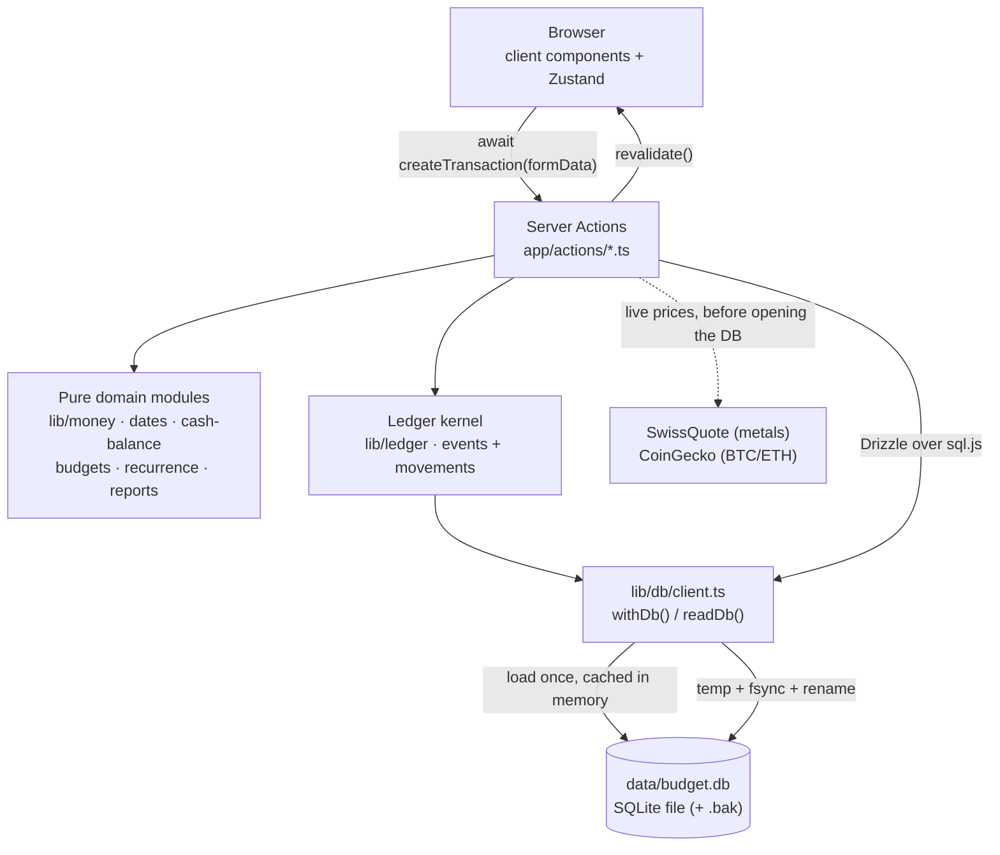

# LocalFi

A local-first personal finance app: track net worth across accounts and asset classes, log transactions and transfers against budgeted categories, run recurring templates, and report on where the money went. Single user, single file, no cloud.

Everything lives in one SQLite file (`data/budget.db`) that you own. There are no user accounts, no sync service, and no telemetry. Data reaches the browser through Next.js Server Actions.

> **Design principle** — the database is a *file*. Before first access, the client acquires a cross-process writer lease and applies journaled migrations against a recoverable backup. Every mutation then goes through `withDb(fn)`, which serializes in-process writers and commits the SQLite work atomically before flushing the file. See [Invariants](#invariants--gotchas).

> **Known limitation: there is no authentication.** Server Actions are POST endpoints, and anything that can reach the port can read and write the whole financial database. The mitigation for the container path is that it is not published beyond loopback: `docker-compose.yml` binds `127.0.0.1:1313:1313`. `next dev` listens on all interfaces, so treat it as trusted-network-only. Auth is out of scope for now — do not expose this app to the internet as it stands. See [Security posture](#security-posture).

---

## Two rules that run through the whole codebase

Break either of these and money goes quietly wrong. Both are enforced by their own module and pinned by tests.

| Rule | Owner | What it means |
| --- | --- | --- |
| **Money is integer cents.** | `lib/money.ts` | Every money column is `*_cents` and every value is a `Cents` (a safe integer). Parse with `parseAmount` / `tryParseAmount`, format with `formatMoney`, add with `sumCents`. `centsToDecimal` exists **only** for a display/chart boundary — never for arithmetic, comparison, aggregation or storage. Every exported function throws on a non-integer, so a float that leaks in fails loudly. |
| **Dates are calendar days, not instants.** | `lib/dates.ts` | A day is a `DateKey` — a `'YYYY-MM-DD'` string that sorts in calendar order. **Never call `toISOString()`** on a calendar day (it converts to UTC first and shifts the day for anyone east or west of UTC), and never `new Date(someString)` on imported input. Build Dates from local components (`new Date(y, m, d)`), serialize with `toDateKey`, parse imports with `parseFlexibleDate` / `parseExcelSerial`. |

`bun run test:tz` re-runs the whole suite at UTC+14 and UTC−11 specifically to catch a regression of the second rule.

## Ports & services

| Service | Port | Purpose | Started by |
| --- | --- | --- | --- |
| Next.js app (dev) | `1313` | App Router UI + Server Actions, Turbopack | `bun run dev` |
| Next.js app (prod) | `1313` | Standalone server (`node server.js`), bound to loopback on the host | `docker compose up` |
| Drizzle Studio | `4983` | Browse/edit the SQLite file in a GUI | `bun run db:studio` |

`bun run start` runs `next start` with no `-p`, so a bare local production run listens on **3000**; the Docker image sets `PORT=1313`.

There is no separate database process — SQLite is read and written in-process via [sql.js](https://sql.js.org) (WebAssembly).

## Prerequisites

| Tool | Version | Check | Install |
| --- | --- | --- | --- |
| Node.js | 20+ (Docker image pins 20; 22 works) | `node --version` | [nodejs.org](https://nodejs.org) |
| Bun | 1.3.14 | `bun --version` | [bun.sh](https://bun.sh/docs/installation) |
| Docker + Compose | any current | `docker compose version` | [docs.docker.com](https://docs.docker.com/get-docker/) — only for the container path |

> **Run `bun install --frozen-lockfile` on the machine that will run the app.** `node_modules` contains platform-specific binaries. Never copy it between Windows, Linux, macOS, WSL, or different CPU architectures; reinstall from `bun.lock` instead.

## Getting started

### Local development

```bash
bun install --frozen-lockfile
cp .env.example .env.local     # optional — defaults work as-is
bun run db:setup               # replay every migration, then seed 15 default categories
bun run dev
```

Open <http://localhost:1313>.

**Verify:** `bun run db:setup` replays the current migration journal, prints a `Tables: …` line, saves `data/budget.db`, and seeds the default categories. `bun run dev` prints `- Local: http://localhost:1313`. The dashboard loads with an empty net-worth chart, `/accounts` shows the seeded `Main` account at $0.00, and the sidebar reads `Cash $0.00`.

Want something to look at? `bun run db:sample` adds five example assets and six transactions.

### Docker

```bash
docker compose down
docker compose up --build -d
```

Open <http://localhost:1313>.

**Verify:** `docker compose ps` shows the `app` service as `healthy` within ~20–40s (there is a `wget` healthcheck against `/`). The server itself is ready in well under a second; the delay is the healthcheck interval.

Two things in `docker-compose.yml` look like tidy-up candidates and are not:

- The port is published as `127.0.0.1:1313:1313`, **not** `1313:1313`. The app has no authentication, so publishing on all interfaces would hand the whole database to the local network.
- The healthcheck probes `http://127.0.0.1:1313/`, **not** `localhost`. Alpine's `wget` resolves `localhost` to `[::1]`, while the standalone server binds `0.0.0.0` (IPv4 only) — a `localhost` probe is refused forever and the container never leaves `health: starting`.

The image builds its **own empty database** during `docker build` (`bun run db:setup`), but Compose bind-mounts your local `./data` directory over `/app/data` at runtime. Your local data is excluded via `.dockerignore`, so your real finances never enter an image layer. The default Compose graph is core-only; enable the optional AI sidecar with `docker compose --profile ai up` or the snapshot scheduler with `docker compose --profile scheduler up`. `docker compose down` followed by plain `docker compose up` reuses the old image; include `--build` whenever source files changed.

### Verifying a change

```bash
bun run lint
bun run typecheck                 # generates Next route types, then runs strict tsc
bun run test
bun run build                     # optimized standalone build via webpack
```

Run `bun run test:tz` as well when changing date or ledger behavior. The
scripts use explicit Node entrypoints for ESLint, TypeScript, Vitest, and Next
because this filesystem can make `.bin` shims non-executable.

## Testing

Vitest, `environment: "node"`, no jsdom. Tests live in `**/__tests__/**` next to the code they cover and are picked up from `{lib,app,components,scripts,eval}/**/__tests__/**/*.test.{ts,tsx}` (see `vitest.config.ts`). Product release checks may intentionally use a narrower list that excludes prohibited or deferred AI scope and the known sandbox subprocess file; that does not change Vitest's configured discovery.

| Command | Does |
| --- | --- |
| `bun run test` | One full run. |
| `bun run test:watch` | Watch mode. |
| `bun run test:tz` | Two full runs, at `TZ=Pacific/Kiritimati` (UTC+14) and `TZ=Pacific/Niue` (UTC−11). Node reads `TZ` once at process start, so this **must** be a separate process — stubbing `TZ` inside a test does nothing. |

**How to add a test here.** There is no jsdom, so components cannot be rendered. The convention is to extract the logic out of the `.tsx` and unit-test it:

- pure logic goes in a sibling `*-logic.ts` (or a plain `.ts`) module — `components/transactions/import-logic.ts`, `components/budgets/budget-form-logic.ts`, `components/reports/report-view-logic.ts`, `components/dashboard/cash-series.ts`;
- the `.tsx` becomes wiring that imports it;
- the test targets the `-logic` module.

Server actions are tested against a real throwaway database: `app/actions/__tests__/support/temp-db.ts` points `BUDGET_DB_PATH` at a temp directory and replays the migration journal into it. Two tests assert *code shape* rather than behaviour, deliberately, because rendering is impossible: `components/__tests__/error-surfacing.test.ts` (every dialog must inspect an action's `{ error }`) and `app/actions/__tests__/money-boundaries.test.ts`.

## Architecture



| Layer | Location | Responsibility |
| --- | --- | --- |
| Pages | `app/(dashboard)/` | Route UI. `/accounts`, `/budgets`, `/recurring`, `/reports` are async server components that fetch and hand off to a `*-client.tsx`; `/`, `/transactions`, `/settings`, `/travel` are `"use client"`. |
| Server Actions | `app/actions/` | Every read and write. The only code that touches the database. |
| Domain logic | `lib/money.ts`, `lib/dates.ts`, `lib/cash-balance.ts`, `lib/budgets.ts`, `lib/recurrence.ts`, `lib/reports.ts`, `lib/prices.ts` | Pure, dependency-light, unit-tested. A `"use server"` file may only export async functions, which is why the rules live here and not in the actions. |
| DB access | `lib/db/client.ts` | Loads the SQLite file into sql.js, wraps it in Drizzle, exposes `withDb()` / `readDb()`. |
| Schema | `lib/db/schema/` | Drizzle table definitions — the source of truth for the data model. |
| Migrations | `drizzle/migrations/` | Generated SQL + `meta/_journal.json` ordering. Startup applies pending supported entries before exposing the shared database handle; legacy one-shot appliers remain for old/manual recovery workflows. |
| Client state | `lib/stores/` | Zustand stores for dashboard and transactions view state (dialogs, filters, sorting). |
| Feature components | `components/{accounts,assets,budgets,dashboard,ledger,recurring,reports,settings,transactions,shared}/` | Dialogs, charts, import flow, sidebar, theme toggle, and the virtualized ledger explorer — plus the `*-logic.ts` modules the tests target. |
| Primitives | `components/ui/` | shadcn/ui components. Regenerate rather than hand-edit. |

### Routes

| Route | Page | What it does |
| --- | --- | --- |
| `/` | `app/(dashboard)/page.tsx` | Currency-bucketed net worth/history, asset allocation, and an explicitly denomination-scoped cash candlestick chart (daily/weekly/monthly). |
| `/accounts` | `accounts/page.tsx` → `accounts-client.tsx` | Accounts grouped by asset/liability with derived balances, archive toggle, live-price refresh + daily net-worth recording, and a repair card for transactions with no account. |
| `/transactions` | `transactions/page.tsx` | Ledger with month/category filters, sorting, category breakdown, pending queue, transfers, spreadsheet import. |
| `/recurring` | `recurring/page.tsx` → `recurring-client.tsx` | Recurring templates, an "upcoming" list, and the *generate due transactions* button. |
| `/budgets` | `budgets/page.tsx` → `budgets-client.tsx` | This period, History, one-off monthly Reallocations, and Categories. The sidebar labels this route **"Categories"**. |
| `/reports` | `reports/page.tsx` → `reports-client.tsx` | Cash-flow and Investments tabs. Investments plots each holding from the daily net-worth child ledger and has clickable line visibility controls. |
| `/ledger` | `ledger/page.tsx` → `components/ledger/ledger-explorer.tsx` | Read-only dynamic event/hash-chain explorer; available when Settings → Developer tools → Show ledger explorer is enabled. |
| `/travel` | `travel/page.tsx` | Cities grouped by country, with mapcn flat/globe views and explicit city-to-city arcs. |
| `/settings` | `settings/page.tsx` | Display name, theme, accent colour, quick-command editor. |

### Data model

All money columns are **integer cents**. All calendar-day columns are `'YYYY-MM-DD'` **text**; `transactions.date` is the one money-adjacent timestamp left.

| Table | Key columns | Notes |
| --- | --- | --- |
| `accounts` | `name` (unique), `kind`, `type`, `opening_balance_cents`, `opening_balance_date`, `currency`, `archived` | `kind` is `asset` \| `liability`; `type` is Checking/Savings/Cash/CreditCard/Loan/Mortgage/Investment/Other. One table for both halves of the balance sheet, so net worth is one query and the halves cannot drift. `opening_balance_cents` is a **magnitude in the user's direction** — a card with $500 outstanding stores `50000`; the single sign flip is `signedOpening` in `lib/cash-balance.ts`. The opening balance contributes only on or after `opening_balance_date`. |
| `transactions` | `date`, `category_id`, `account_id`, `transfer_account_id`, `amount_cents`, `direction`, `currency`, `comment`, `pending`, `recurring_id`, `recurring_occurrence` | Compatibility transaction projection: `amount_cents` is a positive magnitude and snapshotted `direction`/`currency` carry its meaning; journal movements carry the signs. `category_id` is **nullable**: a transfer has no category. A **transfer** has `direction = transfer`, `transfer_account_id` set, and is net-neutral to net worth and excluded from income, expense and budget spend. `(recurring_id, recurring_occurrence)` is a partial UNIQUE index, which makes recurring generation idempotent in the database rather than in a cursor. |
| `categories` | `name` (unique), `type`, `monthly_limit_cents`, `icon`, `color` | `type` is `Income` \| `Expense` \| `Investment`. `icon` is a Lucide icon name. `monthly_limit_cents` is the **legacy** budget: still honoured as a monthly budget for any category with no `budgets` row (`budgetsFromLegacyLimits`). |
| `budgets` | `category_id`, `period`, `limit_cents`, `effective_from`, `effective_to`, `rollover` | `period` is `weekly` \| `monthly` \| `yearly`. `effective_from`/`_to` are inclusive `DateKey`s; `effective_to` NULL means still in force. Income categories are rejected because budgets are spending limits. `rollover` carries an unused surplus into the next period. |
| `budget_reallocations` | `month`, `from_category_id`, `to_category_id`, `amount_cents`, `input_mode`, `input_value` | Moves room between two monthly budgets for one `YYYY-MM` month. The stored cents are authoritative; percentage input is resolved when saved so later permanent budget changes do not rewrite history. |
| `recurring_transactions` | `name`, `account_id`, `transfer_account_id`, `category_id`, `amount_cents`, `frequency`, `interval`, `start_date`, `end_date`, `next_due`, `last_generated`, `archived` | `start_date` is the **anchor**: occurrences are computed from it by index, so "the 31st" clamps to Feb 28 for February only and returns to the 31st in March. `next_due` and `last_generated` are cursors, not the rule. Setting `transfer_account_id` makes each occurrence a transfer. |
| `assets` | `category`, `current_value_cents`, `currency`, `notes`, `commodity_type`, `quantity`, `unit`, `price_symbol`, `priced_at`, `use_live_price`, `archived` | Standalone holdings, alongside accounts. **No `name` column** — use `notes` as the label. `quantity` is deliberately a `real` (a weight or a coin count, not money). `unit` is `oz`/`grams` for metals and `coins` for crypto. `price_symbol` — not `category`, not `commodity_type` — decides which feed prices it. `priced_at` NULL means it was never live-priced. Archived holdings leave normal current views without deleting history. |
| `net_worth_snapshots` | `date` (unique), `currency`, `total_assets_cents`, `total_liabilities_cents`, `net_worth_cents`, `source`, `source_note` | One aggregate row per local calendar day. The row has one denomination; mixed-currency ledgers are bucketed for presentation and snapshot recording refuses to fabricate a scalar total. Recorded observations outrank reconstructed estimates. |
| `settings` | `user_name`, `accent_color`, `theme`, `show_ledger` | Single row; `show_ledger` controls visibility of the read-only Ledger explorer navigation. |
| `quick_commands` | `command`, `category_name`, `amount_cents`, `comment` | Powers the `/shortcut` autocomplete. Links to categories **by name**, not id. |
| `visited_countries` | `country_code` (unique, ISO 3166-1 alpha-3), `country_name` | Internal parent rows created and removed with itinerary cities; there is no standalone country workflow. |
| `travel_checkpoints` | `country_code`, `city_name`, `latitude`, `longitude`, `origin_city_id`, `visited_at` | Stored city coordinates. `origin_city_id` is an optional self-reference for one map connection and becomes NULL if its origin city is deleted. The physical table name is retained for migration compatibility. |
| `asset_history` | `asset_id`, `value_cents`, `recorded_at`, `recorded_day` | Holding-level child rows written atomically with daily net-worth snapshots and reconstruction. `(asset_id, recorded_day)` is unique; re-running a day replaces that day's values, so the investment chart cannot duplicate a holding. Rows before acquisition are omitted rather than stored as fake zeroes. |
| `instruments` / `instrument_observations` | instrument identity; price/valuation observations | Ledger instruments and market-value observations. Observations describe value; they are not cash movements. |
| `ledger_accounts` | `id`, `target_type`, `target_ref`, `currency` | Registered destinations for real accounts, categories, instruments, and system entries. |
| `ledger_events` / `ledger_movements` | UUID identity, `sequence`, `previous_hash`, `hash`; ordered `position` | The single global append-only journal and ordered movements carrying signed positive/negative amounts covered by the canonical payload hash; they are not cryptographically signed. Each event balances exactly in every currency. |
| `ledger_projection_state` / `instrument_positions` | projection checkpoint; quantity/book amount/current event | Rebuildable ledger-derived transaction and instrument state. |

Migrations, in journal order (`drizzle/migrations/meta/_journal.json`):

| Tag | What it did |
| --- | --- |
| `0000_acoustic_natasha_romanoff` | Baseline: categories, transactions, assets, asset_history, quick_commands, settings. |
| `0001_natural_the_santerians` | `visited_countries`. |
| `0002_money_to_cents` | Every `real` money column → integer `*_cents`. |
| `0003_accounts_and_budget_periods` | `accounts` (+ a seeded `Main` account), transfers, nullable `category_id`, `budgets`, `recurring_transactions`, `net_worth_snapshots`. |
| `0004_priced_holdings` | `assets.price_symbol`, `assets.priced_at`. |
| `0005_reconstructed_net_worth` | Marks net-worth rows as recorded or reconstructed and stores estimate provenance. |
| `0006_budget_reallocations` | One-off monthly transfers between category budgets. |
| `0007_travel_checkpoints` | City coordinates linked to their country. |
| `0008_travel-routes` | Optional city-to-city route origins with `ON DELETE SET NULL`. |
| `0009_ledger-semantics` | Explicit transaction direction/currency and account opening-day semantics. |
| `0010_currency-safe-holdings` | Currency-safe assets/history and denomination-aware net-worth snapshots. |
| `0011_budget-goals` | Budget goals. |
| `0012_immutable-ledger` | Instruments, observations, registered ledger accounts, global append-only events/movements, projections, and transaction linkage. |
| `0013_ledger-explorer` | Ledger explorer support and persisted visibility preference. |

### Ledger semantics

Confirmed financial facts are posted to one global append-only `ledger_events`
chain. Each event has a UUID identity, a database-assigned positive `sequence`,
canonical payload, SHA-256 `hash`, and the preceding event's `previous_hash`.
Its `ledger_movements` are ordered by `(event_id, position)` and carry signed
positive/negative amounts covered by the canonical payload hash; they are not
cryptographically signed. UUIDs identify events while sequence supplies chain
order. Every event balances exactly per currency. The database sequence and
`previous_hash` are the durable linked structure; the UI does not maintain a
duplicate JavaScript linked list.

Pending drafts are mutable transaction rows, visible only in the Transactions UI
and pending queue, and deliberately eventless. They do not enter
`ledger_events` until confirmation; when a draft is confirmed, it receives its
first event. Changes or deletes to confirmed facts append a correction event
pointing to the earlier event; the earlier event is never rewritten. Balances,
category spend, and instrument positions are derived from the ledger; account
and category definitions are metadata. Market value is represented by
instrument observations. `assets` and `asset_history` remain compatibility
projections, not a second source of ledger truth.

Legacy holdings remain independent imported instrument identities even when
symbols match; new purchases use the canonical provider-symbol identity. This
avoids fabricated consolidation or row deletion. Cash is account-derived and
excluded from instrument migration. Migration-generated opening dates use
local `DateKey`s with provenance.

The chain is tamper-evident, not independently tamper-proof: a user with full
database write access can recompute a suffix. Future signing or external
anchoring remains possible.

Settings → Developer tools → **Show ledger explorer** controls the conditional
Ledger sidebar item. `/ledger` is a dynamic, read-only route: it loads the
current cursor page and integrity result, then renders newest events first.
Pages use a `beforeSequence` cursor (30 by default, 75 maximum), with filters
for effective date range, currency, target type, and text/sequence/hash search.
The client uses TanStack Virtual for vertical rendering while retaining the
visible predecessor links; see the [React virtualizer docs](https://tanstack.com/virtual/latest/docs/framework/react/react-virtual).
Expanded events show UUID, canonical payload, metadata, hash, predecessor,
ordered movements, per-currency balances, and append-only corrections. Privacy
mode masks financial values and hides canonical metadata/payload; UUIDs, hashes,
sequences, and other structural diagnostics remain visible. Verification is
read-only and available in the explorer and through `ledger:verify`. Base cursor
responses withhold canonical metadata and payload; a capped exact-event read
happens only on expansion while privacy is off, is purged on privacy activation,
and correction navigation can load off-page virtualized targets.

`bun run ledger:rebuild` is projection-only. It rebuilds confirmed transaction
rows and allocations, instrument positions, managed non-Cash asset projections,
and the first denomination-scoped derived Cash compatibility row. It preserves
pending drafts, extra Cash rows, metadata definitions, events/movements, and
instrument observations. `ledger:verify` reports a first-Cash mismatch as a
private projection invariant, without exposing financial values. Already-
journaled projection damage is recoverable with the rebuild; unjournaled
SQL-only adoption of 0012 fails closed.

## Where to put new code

| Task | Location | Follow this example |
| --- | --- | --- |
| Add a database table or column | `lib/db/schema/*.ts`, export it from `schema/index.ts`, then `bun run db:generate` | `lib/db/schema/net-worth.ts` |
| Add a read or write operation | a `"use server"` file in `app/actions/` | `app/actions/travel.ts` (small CRUD flow) or `app/actions/accounts.ts` (larger domain flow) |
| Add a business rule (a balance, a period, a ratio) | a pure module in `lib/`, imported by the action | `lib/cash-balance.ts` |
| Add a page | `app/(dashboard)/<route>/page.tsx` (+ a `<route>-client.tsx` if it needs interactivity), plus a `navigation` entry in `components/shared/sidebar.tsx` | `app/(dashboard)/recurring/` |
| Add a create/edit dialog | `components/<feature>/<thing>-dialog.tsx`, with the validation in `<thing>-form-logic.ts` | `components/budgets/budget-dialog.tsx` + `budget-form-logic.ts` |
| Add testable component logic | `components/<feature>/<thing>-logic.ts` + `components/<feature>/__tests__/<thing>-logic.test.ts` | `components/reports/report-view-logic.ts` |
| Add shared view state (dialog open, filters) | `lib/stores/<feature>-store.ts` | `lib/stores/dashboard-store.ts` |
| Add a shadcn primitive | `bunx --bun shadcn@latest add <name>` → lands in `components/ui/` | any file in `components/ui/` |
| Add a browser-only dependency (maps, canvas) | import with `next/dynamic` + `ssr: false` | `TravelMap` in `app/(dashboard)/travel/page.tsx` |
| Add a live-priced instrument | a `PRICED_HOLDINGS` entry in `lib/prices.ts` + the symbol in `priceSymbols` in `lib/db/schema/assets.ts` (a test asserts the two lists match) | the `BTC` entry |
| Add a confirmed financial fact | Post one balanced event through `lib/ledger/post-event.ts`; update projections in the same `withDb` transaction | `app/actions/transactions.ts` |
| Add a ledger explorer concern | `lib/ledger/explorer.ts` for read/query logic; `components/ledger/ledger-explorer.tsx` for display | `app/(dashboard)/ledger/page.tsx` |

## Server Actions

Components call server actions directly. The authenticated `/api/agent` and `/api/snapshot` endpoints exist for the local sidecar and scheduler; `/api/snapshot` calls the same `recordNetWorthToday` service as both visible buttons. The house pattern is: validate input, do any slow I/O (a price fetch) **first**, then one `withDb(...)` for the write, then `revalidate(...)`.

| File | Functions |
| --- | --- |
| `accounts.ts` | Account queries/mutations plus `recordNetWorthToday` (refresh all live-priced holdings, then persist today) and the lower-level network-free `snapshotNetWorth({ dateKey })`. |
| `transactions.ts` | `getTransactions`, `getTransfers`, `syncCashAssetManually`, `createTransaction`, `updateTransaction`, `confirmTransaction`, `deleteTransaction`, `createTransfer`, `updateTransfer` |
| `budgets.ts` | Budget queries/mutations plus `getBudgetReallocations`, `createBudgetReallocation`, and `deleteBudgetReallocation`. |
| `recurring.ts` | `getRecurringTransactions`, `getUpcomingRecurring`, `getRecurringFormOptions`, `createRecurringTransaction`, `updateRecurringTransaction`, `setRecurringArchived`, `deleteRecurringTransaction`, `generateDueTransactions` |
| `categories.ts` | `getCategories`, `createCategory`, `updateCategory`, `countCategoryUsage`, `deleteCategory` |
| `assets.ts` | `getAssets`, `getInvestmentHistory`, `createAsset`, `updateAsset`, `deleteAsset` |
| `crypto.ts` | `getLivePriceQuote`, `createLivePricedAsset`, `updateLivePricedAsset`, `refreshLivePricedAssets` — one batched CoinGecko request can reprice every configured metal and crypto holding. |
| `commodities.ts` | `calculateCommodityValue` — the legacy metals-facing value wrapper over `lib/prices.ts`; no database access |
| `import.ts` | `importTransactions` — a whole spreadsheet in one `withDb`: validate every row, insert nothing if any row is bad, dedupe by account/currency/direction plus row facts, re-derive the denomination-scoped legacy Cash row once |
| `export.ts` | `exportTransactionsCsv`, `exportJsonBackup`, `describeDatabaseLocation`, `exportDatabaseFile` |
| `settings.ts` | `getSettings`, `updateSettings` (settings and quick commands are saved together, in one atomic `withDb`) |
| `travel.ts` | `getTravelCities`, `addTravelCity`, `setTravelCityOrigin`, `deleteTravelCity` |

## Getting your data out

All three live on `/reports` → **Export**.

| Export | Fidelity |
| --- | --- |
| **CSV** of transactions over a range | Header row is `Date, Category, Amount, Description, Type, Account, Pending, Transfer To, Currency`. The first five names are exactly what the app's own importer looks for, so a CSV export **round-trips back through the importer** — asserted end-to-end in `lib/__tests__/reports-csv-roundtrip.test.ts`. `Amount` is the stored magnitude; direction comes from the category. UTF-8 BOM, CRLF. |
| **JSON backup** of every table | Human-readable and lossless: money is an exact two-decimal string that `parseAmount` reads back to the same integer cents. |
| **The SQLite file** | The real backup. Read inside `readDb(...)` so no flush can be in flight, and the SQLite header is verified before the bytes are handed over, so a corrupt file is refused rather than downloaded as a "backup". |

Import (Transactions → *Import*) accepts **`.xlsx`, `.xls` and `.csv`**, all through the same reader and the same rules. Recognised column headers, case- and space-insensitive:

| Column | Aliases | Required | Notes |
| --- | --- | --- | --- |
| `Date` | `Transaction Date`, `Value Date`, `Posted` | Yes | Excel serial numbers or `YYYY-MM-DD`. |
| `Amount` | `Value`, `Sum` | Yes | Sign is used to infer a type when the file names none, then dropped — the magnitude is stored. |
| `Category` | — | Yes | Matched to an existing category by exact name. Unknown names prompt you to create them. |
| `Description` | `Comment`, `Details`, `Narrative`, `Memo` | No | |
| `Type` | — | No | Only used when creating a missing category, or to infer direction; defaults to `Expense`. |

`DD/MM` vs `MM/DD` is **never guessed silently**. `detectDateOrder` looks for unambiguous evidence in the file (a day > 12), and the dialog exposes an explicit day-first toggle for the rest. `.xlsx`/`.xls` date cells are read as raw serials, so most files never reach the ambiguous path at all.

## Configuration

Copy `.env.example` to `.env.local`. **The defaults work with no changes** — nothing here is required.

| Variable | Required | Description |
| --- | --- | --- |
| `BUDGET_DB_PATH` | No | **Where the app reads and writes the database.** Absolute, or relative to `process.cwd()`. Defaults to `<cwd>/data/budget.db`. Honoured by `lib/db/client.ts` *and* by `lib/db/init.ts`, so `db:init` and the app can never disagree about which file is "the database". This is how the test suite works in a temp directory. Not in `.env.example`. |
| `BUDGET_DB_DEBUG` | No | `1` / `true` emits the verbose `[DB] …` lifecycle logs. Errors and warnings are always logged. |
| `DATABASE_URL` | No | Read **only** by `drizzle.config.ts`, i.e. the `drizzle-kit` CLI (`db:generate`, `db:push`, `db:studio`). Defaults to `file:./data/budget.db`. Setting it does **not** move where the app reads and writes — that is `BUDGET_DB_PATH`. |
| `NODE_ENV` | No | Standard Node/Next convention. |
| `NEXT_PUBLIC_APP_URL` | No | Set in `docker-compose.yml` but **not read anywhere in the application code**. Harmless; kept for future absolute-URL needs. |

**Secrets policy:** the core app needs no secrets and both price feeds are public and keyless. Optional scheduler/API integrations use explicit tokens and are disabled by default; never commit them. `.env*.local`, `/data` and `*.db` are gitignored; keep it that way, because `data/budget.db` is your actual financial history.

## Security posture

Stated plainly, because an open-source finance app invites the question:

- **No authentication, no authorization, no rate limiting.** Server Actions compile to POST endpoints; anything that can reach the port can do anything the UI can do. This is a decided trade-off for a single-user local app, not an oversight to be fixed by a reverse proxy afterthought.
- **The mitigation is the binding.** `docker-compose.yml` publishes `127.0.0.1:1313:1313`. Do not change that to `1313:1313`, and do not put this behind a public ingress, without adding auth first. Note that `next dev` (and `next start` without `HOSTNAME`) listens on all interfaces — the loopback guarantee is the compose file's, not the framework's.
- **Outbound traffic** is listed in [Invariants](#invariants--gotchas). Nothing is ever pushed; no telemetry.
- **Your data never enters the image.** `data` is in `.dockerignore`; the image builds its own empty database.

## Workflow example

The golden path — log a coffee, watch the balance move:

1. **Set up a shortcut.** Settings → Quick Commands → add `command: coffee`, `category: Dining`, `amount: 4.50`, `comment: Coffee`. Save.
2. **Log it.** Transactions → *Add Transaction* → type `/coffee` in the description field. The dialog autocompletes category, amount, and comment. Submit.
3. **What happened server-side.** `createTransaction()` parsed `"4.50"` to `450` cents via `parseAmount`, resolved the account (the form's, else the oldest non-archived asset account), snapshotted direction/currency on the positive-magnitude compatibility transaction row, and appended one balanced account/category ledger event whose movements carry the signs. The same transaction updates the compatibility projection, including `Cash`; `syncCashAssetWithin()` maintains that projection and is not the source of truth. The whole write commits through one `withDb()` flush, then `revalidate("/transactions", "/")` runs as a non-fatal cache hint.
4. **See it.** The sidebar's Cash figure drops by $4.50, the dashboard's net worth follows, `/budgets` shows Dining $4.50 closer to its $70 monthly limit, and `/reports` counts it as expense in the current period.

Not sure whether a transaction really cleared? Mark it **pending**. It sits in a separate queue on `/transactions` and is excluded from every balance, budget and report figure until you confirm it with a date — reports count and subtotal what they excluded rather than dropping it silently.

Moving money between your own accounts? Use a **transfer**, not two transactions. `createTransfer` stores one row with `transfer_account_id` set and no category, which is net-neutral to net worth and invisible to income, expense and budget totals.

## Invariants & gotchas

Things that break if you change them carelessly.

**Database**

- **`withDb` is NOT reentrant.** Calling `withDb` inside `withDb` **deadlocks** — the FIFO lock is not recursive. Helpers that need an open handle take one as a parameter instead (`syncCashAssetWithin(db)` in `lib/db/sync-cash.ts`). Likewise, **do slow I/O before you open the lock**: a price fetch inside `withDb` holds every other writer for the duration of a network round trip. `app/actions/crypto.ts` fetches, *then* writes.
- **`getDb()` / `saveDb()` are deprecated but not gone.** They share one cached database but cannot roll back or group a read-modify-write. Product mutations use `withDb`; legacy setup/migration scripts retain the compatibility pair.
- **A failed `withDb` callback discards the in-memory image.** That is the point: partial work cannot be flushed by a later save. The next call reloads from disk.
- **`PRAGMA foreign_keys = ON` is re-applied after every flush.** `sql.js`'s `Database.export()` internally closes and re-opens the connection, which silently resets connection-scoped pragmas. `applySessionPragmas` runs after every load *and* after every export. Remove that second call and foreign keys quietly stop being enforced.
- **A corrupt or unreadable file throws `DatabaseCorruptError`; it never boots an empty database.** Silently starting fresh over somebody's finances is the worst possible failure mode. The previous generation is kept at `data/budget.db.bak` on every flush.
- **`db:init` refuses to overwrite a non-empty database.** That guard is the only thing between a stray `bun run db:setup` and your entire financial history. Pass `--force` only when you mean it.
- **`lib/db/client.ts` carries a legacy auto-migration net** that adds `transactions.pending` and creates `visited_countries` if missing, for databases created before those migrations existed. New schema changes belong in a real migration; that block is repair, not the mechanism.
- **Only one LocalFi writer may own a database path.** A cross-process lease rejects a second app or database script with recovery guidance. Do not use `db:studio` to bypass that boundary while the app is running.

**Build & runtime**

- **`next.config.ts` sets `serverExternalPackages: ["sql.js"]`. This is load-bearing — do not "clean it up".** sql.js ships an emscripten/UMD wrapper; when webpack bundles it for the server build, that wrapper's `module.exports` assignment is rewritten and loading it throws `TypeError: Cannot set properties of undefined (setting 'exports')`. The failure is **invisible under `next dev`** (Turbopack) and appears only under `next start` and in the Docker image, where every server-rendered DB-backed route — `/accounts`, `/budgets`, `/recurring`, `/reports` — returns HTTP 500. Marking it external makes the server `require()` it from `node_modules` at runtime, which is also why the Dockerfile copies `node_modules/sql.js` into the runner stage.
- **Lint and type generation are explicit gates.** Next 16 no longer runs ESLint as part of `next build`; run `bun run lint`. `bun run typecheck` first generates App Router types, then runs strict TypeScript. `typescript.ignoreBuildErrors` is `false`, so type errors also fail the production build.
- **Outbound network:** price feeds use SwissQuote and CoinGecko. Travel uses CARTO tiles for the flat map, Natural Earth GeoJSON from jsDelivr for the globe, and an explicit-submit Nominatim lookup when a city is added.

**Domain**

- **The `Cash` asset is derived, never authored.** It is a compatibility row with one stored currency. `syncCashAssetWithin()` overwrites `current_value_cents` from transactions in that currency only; the dashboard exposes separate currency history instead of adding denominations. A second asset with `category: "Cash"` is ignored — sync targets the first one it finds.
- **Cash is excluded from instrument migration.** It is account-derived; imported non-Cash holdings keep independent instrument identities, even for matching symbols, while new purchases use the canonical provider-symbol identity.
- **Categories-tab spend uses journal category movements.** It shares the same movements as budget actuals, rather than maintaining a second spend calculation.
- **Pending transactions are excluded from every balance, budget and report figure.** They remain visible only in the Transactions UI and pending queue; they do not appear in `ledger_events` until confirmation.
- **Transfers are never income or expense, anywhere** — not in balances, not in budget spend, not in reports. A category on a transfer row is ignored outright.
- **`opening_balance_cents` is a magnitude, not a signed figure.** The one sign flip for liabilities is `signedOpening` in `lib/cash-balance.ts`. Add a second one and a mortgage starts inflating net worth.
- **Recurring occurrences are computed from the anchor, not from the last one posted.** Advance-from-last would walk "rent on the 31st" down to the 28th forever. Idempotency rests on the partial UNIQUE index on `(recurring_id, recurring_occurrence)` first and the cursors last.
- **`quantity` is not money.** It stays a float: a troy-ounce weight or a coin count. Only `quantity × price` becomes money, rounded to the cent exactly once, in `lib/prices.ts`. And **a quantity of 0 is a real quantity** — `if (!quantity)` is a bug that has already been fixed once.
- **A failed price fetch writes nothing.** `fetchPriceQuote` never throws and never returns 0; it returns a typed error, and the previously stored value and `priced_at` survive. A live-priced holding persisted at $0 because the network was down once made real gold vanish from net worth.
- **`quick_commands.category_name` is a name, not a foreign key.** Rename a category and its quick commands stop resolving; the manager warns about missing categories on save.
- **`assets` has no `name` column.** Labels live in `notes`. This has bitten scripts before.
- **The ledger is append-only.** Pending drafts are visible only in the Transactions UI and pending queue and do not enter `ledger_events` until confirmation; confirmed changes and deletes append corrections. Never update or delete `ledger_events` or `ledger_movements` directly.
- **Every event balances per currency.** Do not sum denominations together to hide an imbalance.
- **Ledger integrity is tamper evidence, not tamper proof.** Full database writers can recompute a suffix; `bun run ledger:verify` detects accidental or partial edits. Signing or anchoring is future work.
- **0012 migration safety is fail-closed.** A populated SQL-only schema is not adopted without the TypeScript UUID/canonical-payload hash and backfill phase; migration opening dates are local `DateKey`s with provenance. If refreshing `.bak` fails, live replacement is aborted before rename.
- **`revalidate()` (`lib/revalidate.ts`), not `revalidatePath()`, after a write.** `revalidatePath` throws outside a request scope (scripts, tests), and by then the write has already committed — letting it propagate reports "failed" for a save that succeeded, and the user retries and double-posts.
- **Accent colour is injected as inline CSS variables** (`--primary`, `--chart-1`, `--primary-foreground`) by `AccentColorProvider` in `app/providers.tsx`, deliberately leaving `--accent` alone so sidebar contrast survives. Tailwind classes alone won't explain the colours you see.

## Design decisions

The full decision record, including rejected alternatives, lives in
[docs/DECISIONS.md](docs/DECISIONS.md). This README keeps the core invariants
and security warnings; update the decision record when architecture changes.

## Contributor reference

The code map, one-shot migration appliers, complete script table, migration
notes, and end-to-end feature workflow live in [docs/REFERENCE.md](docs/REFERENCE.md).

## Troubleshooting

**`next: Permission denied` or `tsx: Permission denied` from a project script.**

The shims in `node_modules/.bin/` lost their executable bit or came from another platform. Delete `node_modules` and run `bun install --frozen-lockfile` on the current machine. Core checks already call package entry points directly:

```bash
bun run build
bun run lint
bun run typecheck
node node_modules/tsx/dist/cli.mjs lib/db/init.ts
```

`next lint` was removed in Next 16; `bun run lint` invokes ESLint 9 directly.
`bun run test` and `bun run test:tz` invoke `node_modules/vitest/vitest.mjs`
directly for the same filesystem reason.

**`⚠ Mismatching @next/swc version`** during build. A stale platform binary in `node_modules`; delete that directory and run `bun install --frozen-lockfile`.

**`Refusing to open …: it is not a valid SQLite database`.** Deliberate — the app will not replace a non-empty file it cannot read. Inspect the file, or restore `data/budget.db.bak` (the previous generation) or a timestamped copy from `data/backups/`.

**`Refusing to overwrite existing database (N bytes)`** from `db:init`. Also deliberate. Use `--force` only if you truly want to discard that data.

## Tech stack

Next.js 16 (App Router) · React 19 · Bun 1.3 · TypeScript 5 · Tailwind CSS 3 · shadcn/ui + Radix · Drizzle ORM · SQLite via sql.js · Zustand · Recharts · MapLibre GL · `read-excel-file` · Vitest · Lucide


## Docs map

- **This README** is the hub: setup, architecture, conventions, invariants.
- **[docs/REFERENCE.md](docs/REFERENCE.md)** is the source for the contributor code map, migration appliers and split notes, command table, and feature-extension workflow.
- **[docs/DECISIONS.md](docs/DECISIONS.md)** is the source for architecture decisions and rejected alternatives.
- **The data model's real source of truth is `lib/db/schema/`**, not the table above — if they disagree, the schema wins and this README is stale. The same goes for the *rules*: `lib/money.ts`, `lib/dates.ts` and `lib/cash-balance.ts` carry long header comments that are the authority on money, dates and balances respectively.
- **Route, Server Action and column tables are maintained by hand.** Refresh them from `app/(dashboard)/*/page.tsx`, `app/actions/*.ts` and `lib/db/schema/*.ts`.

## License

MIT; see [LICENSE](LICENSE).
